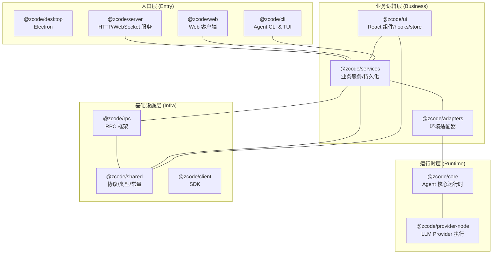
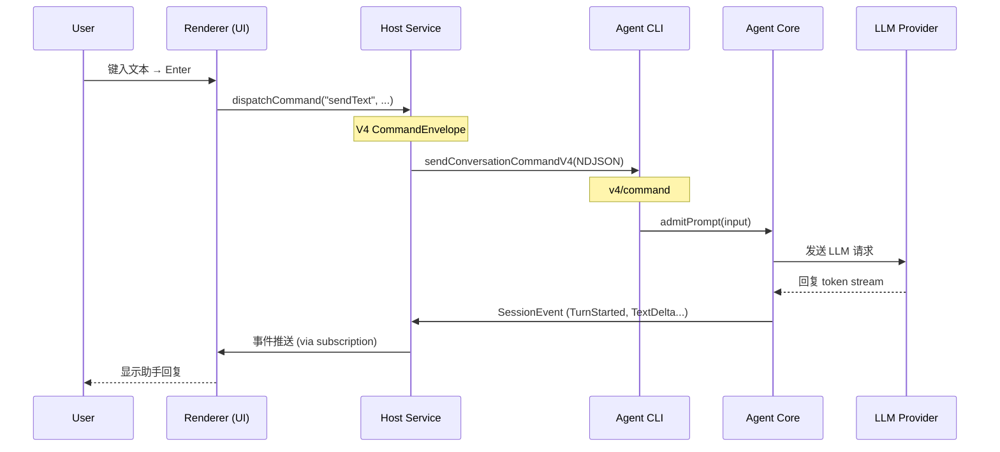
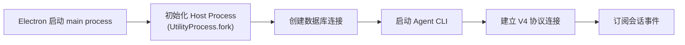
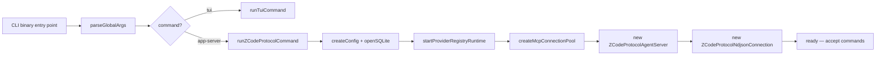

[上一篇](00-docs-style-guide.md) · [总目录](README.md) · [下一篇](02-简单例子-全路径走读.md)

# 系统骨架——ZCode 整体架构概览

> **场景**：让新手能够回答："这个项目做什么？由什么组成？请求是怎么流转的？"
> **层级**：第一层——只描述进程/模块/组件架构，不深入函数实现。

## 1. ZCode 是什么

ZCode 是 **AI 编程工作台**，提供三种运行形态：

```
┌─────────────────────┐    ┌──────────────────┐    ┌──────────────────┐
│   Desktop App       │    │   Web Mode       │    │   TUI / CLI      │
│   Electron 桌面应用   │    │   浏览器版        │    │   终端交互版       │
│   pnpm dev:desktop  │    │   pnpm dev:web   │    │   zcode          │
└─────────────────────┘    └──────────────────┘    └──────────────────┘
            │                        │                      │
            └────────────────────────┼──────────────────────┘
                                     ↓
                    ┌────────────────────────────────┐
                    │    ZCode Agent CLI             │
                    │    @zcode/cli (stdio NDJSON)   │
                    └────────────────────────────────┘
```

三种形态共享同一套 Agent CLI（命令行工具），通过不同的前端（Electron Renderer、Web Browser、Terminal）发起请求，后端都由 Agent CLI 处理。

## 2. 进程模型

ZCode 采用多进程架构，每个进程有独立的职责和生命周期：

### 2.1 进程分类与数量

| 进程类型 | 创建者 | 数量 | 生命周期 | 职责 |
|----------|--------|------|----------|------|
| **Desktop Main** | Electron 启动 | 1/应用 | 应用开→关 | 窗口管理、原生能力、资源调度、Agent 进程 spawn |
| **Host Process** | Main 用 `UtilityProcess.fork()` fork | 1/窗口 | 窗口创建→销毁 | 业务服务实例化、远程连接注册表、与 Agent 通信 |
| **Agent CLI** | Host 用 `child_process.spawn()` | 1/任务会话池 | 按需启动/复用 | LLM 调用、Tool 执行、Turn Loop、事件生成 |
| **Renderer** | Electron/Browser 创建 | N/窗口 | 窗口可见→隐藏 | 用户界面交互、状态展示 |
| **Web Server** | `dev:web` 独立启动 | 0~1 | 手动启停 | 提供 HTTP API + WebSocket，支持远程部署 |

```mermaid
graph TD
    A["Desktop Main"] -->|"fork()"| B["Host #1 (window-1)"]
    A -->|"fork()"| C["Host #2 (window-2)"]
    B -->|"spawn()"/"stdio"| D["Agent CLI #1\nv4/command ↔ core"]
    C -->|"spawn()"/"stdio"| E["Agent CLI #2\n(v4/command ↔ core)"]
    F["Renderer #1"] -->|"MessagePort"| B
    G["Renderer #2"] -->|"MessagePort"| C
    H["Mobile/Remote"] -->|"WebSocket"| B
    H -->|"WebSocket"| C
```

### 2.2 进程间通信方式

| 发送方 → 接收方 | 通信机制 | 协议/格式 | 方向 |
|-----------------|----------|-----------|------|
| Renderer → Host | Electron `MessageChannel` | RPC MessagePort | 双向 |
| Host ↔ Agent CLI | Node.js `spawn` stdin/stdout | **V4 NDJSON 协议** (`v4/command`/`v4/conversation/*`) | 双向 |
| Remote/Mobile → Host | WebSocket + SSH tunnel | 自定义帧协议 | 双向 |
| Agent CLI → OS | native addons / shell | platform-specific | 单向 |

## 3. 模块架构（Monorepo）

仓库采用 pnpm Workspace monorepo，按职责划分约 30 个包：



### 3.1 包清单

| 包 | 源码根路径 | TypeScript 文件数 | 职责 |
|----|-----------|------------------|------|
| `@zcode/ui` | `packages/ui/src` | ~1,477 文件 | 共享 React 组件、hooks、Zustand 状态管理 |
| `@zcode/services` | `packages/services/src` | ~301 文件 | 业务服务：session、agent、task、plugin、oauth、storage 等 |
| `@zcode/desktop` | `packages/desktop/src` | ~265 文件 | Electron Main + Host + Renderer，桌面端入口和平台集成 |
| `@zcode/adapters` | `apps/zcode-cli/packages/adapters/src` | ~202 文件 | Core 的环境抽象层：fs、exec、http、mcp、model 等 |
| `@zcode/bootstrap` | `apps/zcode-cli/packages/bootstrap/src` | ~222 文件 | Agent CLI 启动编排、协议服务端初始化、插件加载 |
| `@zcode/core` | `apps/zcode-cli/packages/core/src` | ~495 文件 | Agent 核心运行时：turn loop、tool registry、event reducer |
| `@zcode/shared` | `packages/shared/src` | ~216 文件 | 协议定义（旧+v4）、共享类型、常量、 zod schema |
| `@zcode/cli` | `apps/zcode-cli/packages/cli/src` | ~81 文件 | CLI 命令行入口：参数解析、命令分发 |
| `@zcode/tui` | `apps/zcode-cli/packages/tui/src` | ~91 文件 | 终端 UI 界面 |
| `@zcode/rpc` | `packages/rpc/src` | ~20 文件 | 基于 MessagePort 的 RPC 框架 |
| `@zcode/client` | `packages/client/src` | ~6 文件 | Agent 客户端 SDK |
| `@zcode/provider` | `packages/provider/src` | ~23 文件 | Provider 公共能力 |
| `@zcode/provider-node` | `packages/provider-node/src` | ~17 文件 | Node 环境下的 Provider 实现 |
| `@zcode/server` | `packages/server/src` | ~51 文件 | HTTP/WebSocket 独立服务（远程部署） |
| `@zcode/web` | `packages/web/src` | ~17 文件 | Web 模式的前端入口 |

## 4. 模块依赖关系

### 4.1 依赖方向矩阵

```text
@zcode/desktop     → @zcode/services, @zcode/shared, @zcode/rpc, @zcode/ui
@zcode/web         → @zcode/ui, @zcode/client, @zcode/shared
@zcode/server      → @zcode/services, @zcode/shared
@zcode/cli         → @zcode/bootstrap, @zcode/core, @zcode/tui
@zcode/bootstrap   → @zcode/core, @zcode/adapters, @zcode/shared, @zcode/provider-node
@zcode/core        → @zcode/adapters, @zcode/shared, @zcode/contracts
@zcode/services    → @zcode/shared, @zcode/rpc
@zcode/adapters    → @zcode/shared-types, @zcode/core (types only)
```

### 4.2 依赖规则（architecture-policy.yaml）

- `managedOnly: true` — 新增模块必须声明 `managed: true`
- `forbidCycles: true` — 禁止循环依赖
- `forbidDeepImports: true` — 禁止跨包深度导入实现细节

## 5. 协议体系

### 5.1 V4 协议（主推）

当前所有新路径收敛到 V4 协议框架：

| 功能域 | 方法前缀 | 说明 |
|--------|---------|------|
| 命令执行 | `v4/command` | 用户输入→Agent 处理的核心通道 |
| 会话订阅 | `v4/conversation/subscribe` | 实时事件推送 |
| 行查询 | `v4/conversation/rowsRange` | 分页读取会话内容 |
| 附件 | `v4/attachment/*` | 分块上传文件 |
| 控制器 | `v4/controller/*` | 工作区/任务索引控制 |

V4 命令注册表位于 `apps/zcode-cli/packages/bootstrap/src/zcode-protocol-v4/commands/handlers/index.ts`，handler 分组：

```text
NATIVE_HANDLERS = {
  // 会话流
  sessionFlowHandlers:  [sendText, stop]

  // 队列管理
  queueHandlers:        [startPromptTurn, promotion, drain]

  // 会话管理
  sessionMgmtHandlers:  [createSession, resumeSession, deleteSession]

  // 选择侧会话
  selectionSideSessionHandlers: [...]

  // 目标/压缩
  goalCompactHandlers:  [compact, goalState]

  // 模型配置
  modelConfigHandlers:  [switchModel, setThoughtLevel]

  // 后台交互
  interactionBackgroundHandlers: [...]

  // Fork/编辑/重试
  forkEditRetryHandlers: [...]

  // 文件回退预览
  fileRewindHandlers:   [...]

  // 助手反馈
  assistantFeedbackHandlers: [...]
}
```

### 5.2 旧协议（逐步淘汰）

遗留方法仍保留兼容性：

| 方法族 | 前缀 | 状态 |
|--------|------|------|
| 会话 CRUD | `session/*` | @deprecated（被 V4 session-mgmt 替代） |
| 发送消息 | `session/send` | @deprecated（被 V4 sendText 替代） |
| 停止运行 | `session/stop` | @deprecated（被 V4 stop 替代） |
| 工作区设置 | `workspace/*` | 部分保留 |
| MCP 列表 | `mcp/list` | 保留 |
| 插件管理 | `plugins/*` | 保留 |

## 6. 数据流向总览

以「用户在会话中发一条消息」为例，看主数据流：



### 6.1 数据流关键节点

| 节点 | 操作 | 数据形式 |
|------|------|---------|
| UI Composer | 收集用户输入、附件引用 | React state |
| SessionPane.dispatchCommand | 包装为 CommandEnvelope | JSON object |
| ConversationTransport.sendCommand | 发送到 Host service | Promise<CommandAck> |
| Host Service Adapter | 转发给 Agent CLI | NDJSON frame |
| Agent V4 Server | 解析并分派到 handler | V4 method string |
| V4CommandExecutor.execute | 路由到具体 handler | CommandEnvelope |
| prompt-turn.startPromptTurn | 验证+适配+传给 Core | SendInputOptions |
| Agent Runtime.admitPrompt | turn admission/queuing | PromptAdmissionReceipt |
| TurnLoop | 执行 LLM call + tools | Event stream |
| EventReducer | 生成 SessionEvent | SessionEventType |
| Host Service | 投递到 UI subscription | 事件对象 |
| UI Store | 投影到 conversation rows | Zustand store state |

## 7. 存储与配置

### 7.1 数据存储

| 存储类型 | 位置 | 用途 |
|----------|------|------|
| SQLite | `~/.zcode/data/<workspace>/sessions.db` | 会话记录、事件日志、上下文快照 |
| IndexedDB | Browser (Web 模式) | 本地缓存 |
| 文件系统 | `~/.zcode/config/` | Provider 配置、账号信息 |

### 7.2 Provider Registry

Provider Registry 是整个系统的**模型事实源**：

```text
Account Config (用户添加的 API Key)
    ↓
Provider Registry (合并 config + accounts → 可用 provider 列表)
    ↓
Model Selection Facade (根据用户选择返回有效模型)
    ↓
Agent Core (使用选定的模型进行 LLM 调用)
```

### 7.3 配置来源优先级

```text
环境变量 > .env.local > .env > 配置文件 > 内置默认值
```

## 8. 安全与权限

| 机制 | 位置 | 作用 |
|------|------|------|
| Permission Broker | Agent Core | 工具调用授权检查 |
| Hook Trust Review | Host + CLI | 代码变更时 hook 信任确认 |
| Off-Peak Tool Policy | Host → CLI (握手阶段) | 闲时任务工具备免策略 |
| Dynamic Workflow Policy | Host → CLI | 动态工作流灰度门禁 |
| Official MCP Auth Headers | CLI → MCP Server | 官方 MCP 认证头注入 |

## 9. 启动流程

### 9.1 Desktop 启动顺序



### 9.2 Agent CLI 启动顺序



## 10. 错误传播

```text
Agent Core 错误
  → SessionEvent (error type)
  → Host Service → UI Subscription
  → UI 展示错误 toast

Host Service 网络错误
  → transport.close → Connection retry
  → retry 失败 → Agent restart

V4 命令拒绝
  → CommandResult.type = "error"
  → UI pendingCommandRegistry.markFailed
```

---

**总结一句话**：ZCode 是一个三态（Desktop/Web/TUI）共用一个 Agent CLI 后端的 AI 编程工作台。前端通过 RPC/V4 协议把用户意图发给 Agent，Agent 负责 LLM 调用和工具执行，然后把结果事件逐跳传回前端渲染。

[上一篇](00-docs-style-guide.md) · [总目录](README.md) · [下一篇](02-简单例子-全路径走读.md)
