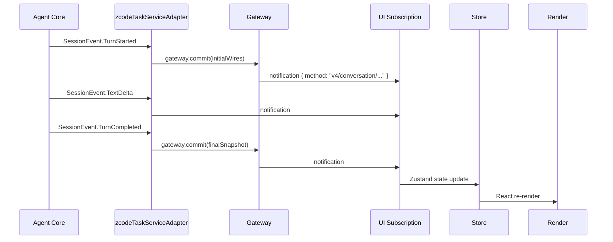
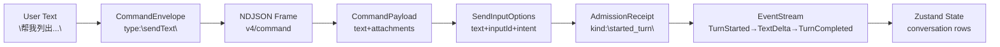

[上一篇](01-简单框架-系统骨架.md) · [总目录](README.md) · [下一篇](03-详细逐步说明-主链路拆解.md)

# 真实案例全路径走读——「用户发送一条文本消息」

> **场景**：桌面端用户在已有会话中键入文本消息，按 Enter 发送，最终在 UI 上看到助手回复。
> **层级**：第二层——只走主成功路径（happy path），不展开异常分支、边界情况。
> **版本**：v1 (2026-09-23)
> **源码基准**：commit `872ad96`

## 1. 场景描述

```
User: "帮我列出当前目录下所有 .ts 文件"
     ↓
Renderer Composer → collect input → dispatchCommand("sendText", ...)
     ↓
Host Service → sendConversationCommandV4(V4_METHODS.command, envelope)
     ↓
Agent CLI V4 Server → handleMessage → dispatchRequest → handler sendText
     ↓
Core Runtime → admitPrompt → turn loop → LLM call → event stream
     ↓
Host → UI subscription → conversation store update → render reply
```

这是一条**完整的端到端路径**，从用户交互到结果展示，覆盖所有进程边界。

## 2. 端到端路径详解

### Step 1: 用户输入与 UI 收集

**位置：** `packages/ui/src/v4/ConversationComposer.tsx`

用户在 Composer 文本框中输入内容，点击 Send（或按 Enter）。

```text
文件：packages/ui/src/v4/ConversationComposer.tsx
组件：ConversationComposer
职责：收集用户输入、附件、模型选择配置，触发提交
```

关键状态：
- `text` (useState) — 用户输入的纯文本
- `pending` (useState) — 是否正在等待发送
- `heldQueueConfirmation` — held choice 下的队列确认弹窗数据

### Step 2: 封装 CommandEnvelope

**位置：** `packages/ui/src/v4/SessionPane.tsx`

```text
文件：packages/ui/src/v4/SessionPane.tsx
函数：dispatchCommand
偏移：+1395 ～ +1461
```

核心逻辑（仅主线）：

```text
1. 调用 createCommandEnvelope() 构造 CommandEnvelope
   - type = "sendText"
   - payload = { text, modelSelection?, modelExecution? }
   - sessionId = current session id
   - commandId = randomUUID()
   
2. 记录到 pendingCommandRegistry（失败后可查）
   
3. 调用 sendCommand(envelope)（通过 props 注入的 ConversationTransport）
   
4. 等待 ack 返回
```

输入示例：

```json
{
  "type": "sendText",
  "sessionId": "session-uuid-1",
  "commandId": "cmd-uuid-1",
  "payload": {
    "text": "帮我列出当前目录下所有 .ts 文件",
    "modelSelection": { "provider": "openai-compatible", "model": "gpt-4o" },
    "modelExecution": { "contextWindowBudget": 0.8 }
  }
}
```

### Step 3: 发送到 Host Service

**位置：** `packages/ui/src/v4/agentConversationTransport.ts`

```text
文件：packages/ui/src/v4/agentConversationTransport.ts
函数：sendCommand
偏移：+350 ～ +375
```

核心逻辑：

```text
1. await ensureHandshake() — 确保 V4 连接已建立
2. agentService.sendConversationCommandV4({ workspace, envelope })
3. 等待 CommandAck 返回
```

传输方式：RPC over MessagePort（UI ↔ Host 进程间通信）。

### Step 4: Host Service 转发给 Agent

**位置：** `packages/services/src/zcode-agent/zcodeAgentService.ts`

```text
文件：packages/services/src/zcode-agent/zcodeAgentService.ts
函数：sendConversationCommandV4
偏移：+5026 ～ +5093
```

核心逻辑：

```text
1. getClient(params) — 获取 V4 连接的 client
2. 校验 planEnabled 能力 → 如需要则 ensureIndependentPlanSupport(client)
3. 确定 commandClientMode（desktop-continuous / web-remote-replayable）
4. buildConversationCommandEnvelope(params) — 组装信封
5. 收集 browserAmbientContext（如有浏览器控制执行器）
6. client.request(V4_METHODS.command, envelope, commandAckSchema)
   → 实际发送 NDJSON 帧到 Agent CLI stdin
7. 返回 CommandAck
```

输入输出数据流：

```
输入: ZCodeAgentConversationCommandParams {
  workspacePath, workspaceIdentity, remoteSessionId?
  envelope: CommandEnvelope { ... }
}
         ↓
NDJSON frame: {"method":"v4/command","params":{"envelope":{...}},"id":"req-id"}
         ↓
输出: CommandAck {
  status: "success",
  delivery: "startNow",
  inputId: "cmd-uuid-1",
  ttft?: number
}
```

### Step 5: Agent CLI 接收并分派

**位置：** `apps/zcode-cli/packages/bootstrap/src/zcode-protocol/server.ts`

```text
文件：apps/zcode-cli/packages/bootstrap/src/zcode-protocol/server.ts
方法：handleMessage
偏移：+406 ～ +462
方法：dispatchRequest
偏移：+458 ～ +463
```

核心逻辑：

```text
switch (request.method) {
  case V4_METHODS.command:
    → this.handleV4Command(request.params.envelope)
}
```

### Step 6: V4 CommandExecutor 路由到 handler

**位置：** `apps/zcode-cli/packages/bootstrap/src/zcode-protocol-v4/commands/executor.ts`

```text
文件：apps/zcode-cli/packages/bootstrap/src/zcode-protocol-v4/commands/executor.ts
类：V4CommandExecutor
方法：execute
偏移：+39 ～ +60
```

核心逻辑：

```text
1. NATIVE_HANDLERS["sendText"] — 查找 handler
2. handler(host, envelope) — 调用 session-flow handlers.sendText()
```

handler 注册表位于 `apps/zcode-cli/packages/bootstrap/src/zcode-protocol-v4/commands/handlers/session-flow.ts`。

### Step 7: sendText Handler 处理

**位置：** `apps/zcode-cli/packages/bootstrap/src/zcode-protocol-v4/commands/handlers/session-flow.ts`

```text
文件：apps/zcode-cli/packages/bootstrap/src/zcode-protocol-v4/commands/handlers/session-flow.ts
函数：sendText
偏移：+184 ～ +301
```

核心逻辑：

```text
1. payload.parse — 提取 text, attachments, heldQueueDisposition, modelExecution
2. hasPromptInput(text, attachments) — 验证非空
3. mapAttachmentRefsToTurnAttachments() — AttachmentRef → TurnAttachment[]
4. applyHeldQueueDisposition() — 如果有 held queue 待裁决，先处理
5. acquireForegroundPromotionLease() — startNow 时抢占前台
6. startPromptTurn(host, record, params) — 进入 prompt-turn 流程
7. 返回 CommandAck { delivery: "startNow" | "queue", inputId }
```

### Step 8: Core Admission & Turn Loop 启动

**位置：** `apps/zcode-cli/packages/bootstrap/src/zcode-protocol-v4/commands/prompt-turn.ts`

```text
文件：apps/zcode-cli/packages/bootstrap/src/zcode-protocol-v4/commands/prompt-turn.ts
函数：startPromptTurn
偏移：+57 ～ +177
```

核心逻辑：

```text
1. ensureModelReady(record) — 确保模型可用
2. record.persistence = "immediate" — 标记持久化
3. record.app.sendInput(input, options) — 调用 App Input Facade
4. admission = app.sendInput(...) → Promise<{ kind: "started_turn"|"queued"|rejected }>
5. if queued → return { admission, turnStarted: resolve() }
6. else → runWithSessionResidencyFinalization → 后台等 completion
7. 返回 { admission, turnStarted: resolve(), completion }
```

### Step 9: Agent Core Turn Execution

**位置：** `apps/zcode-cli/packages/core/src/runtime/agent-runtime.ts`

```text
文件：apps/zcode-cli/packages/core/src/runtime/agent-runtime.ts
类：AgentRuntime
方法：admitPrompt
偏移：见内部
```

核心逻辑（简化版）：

```text
1. 创建或复用 TurnState
2. EventReducer.subscribe(onEvent) — 订阅事件流
3. ModelCall.execute(prompt) — 发送 LLM API 请求
4. StreamToken.collect(callback(event)) — 逐 token 生成 SessionEvent
5. ToolScheduler.schedule(tools) → 调用各 tool handler
6. ContextBuilder.build(context) — 构建上下文
7. 终态 → SessionEventType.TurnCompleted + SnapshotUpdate
```

### Step 10: 事件回流至 UI



## 3. 完整数据结构流动



## 4. 涉及的关键类型

| 类型名 | 来源模块 | 用途 |
|--------|---------|------|
| CommandEnvelope | `@zcode/shared/zcode-protocol-v4` | V4 命令信封 |
| CommandAck | `@zcode/shared/zcode-protocol-v4` | 命令回执 |
| SendInputResult | bootstrap/app/types | Core admission 结果 |
| SendInputOptions | bootstrap/app/types | 输入选项 |
| PromptAdmissionReceipt | core/types | Core 层 admission receipt |
| TurnState | core/runtime | Turn 生命周期状态 |
| SessionEvent | @zcode/contracts | 会话事件 |

## 5. 关键决策点

| 节点 | 决策 | 结果 |
|------|------|------|
| SessionPane.dispatchCommand | 是否记录到 pendingCommandRegistry | 是 → 可查询、可重放 |
| sendConversationCommandV4 | planEnabled → independentPlanSupport | 需协商能力 |
| sendText handler | forceStartNow? → foregroundPromotionLease | startNow 时需抢占 |
| sendText handler | routingMode? → delivery 策略 | guide/queue/startNow |
| startPromptTurn | admission.kind? | started_turn / queued / rejected |

## 6. 此路径未覆盖的内容（留待后续文档）

- ❌ 附件上传/下载完整流程（attachmentBegin/chunk/commit）
- ❌ hold queue 的用户交互回路（interaction/requestPermission）
- ❌ fork 新会话的完整路径
- ❌ automation / off-peak 自动派发场景
- ❌ 断线重连、transport error recovery
- ❌ hook trust review 审核流程

---

**一句话总结**：用户消息从 UI 到 Agent 再到结果回显，全程经过 5 个进程边界（UI→Host RPC, Host→Agent stdio, Agent Core internal, Core→Host stdio, Host→UI RPC），每条消息都带有唯一 commandId 用于对账追踪。

[上一篇](01-简单框架-系统骨架.md) · [总目录](README.md) · [下一篇](03-详细逐步说明-主链路拆解.md)
