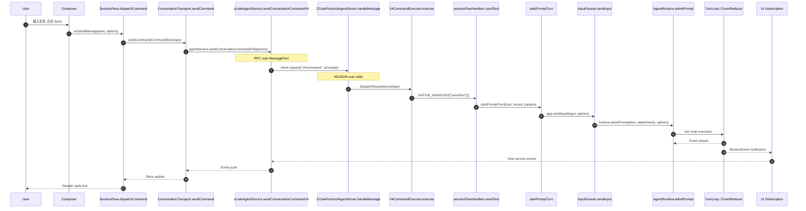
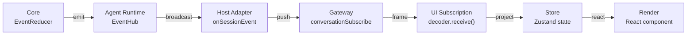
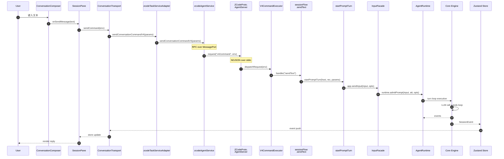

[上一篇](02-简单例子-全路径走读.md) · [总目录](README.md) · [下一篇](04-核心模块与类关系.md)

# 主链路逐跳拆解——「用户发送文本消息 → 收到助手回复」的完整调用链

> **场景**：基于第二层的真实案例，将端到端路径拆成逐跳（hop-by-hop）的详细拆解。每一步说明：谁调用谁、函数名、参数传递、数据转换、内部逻辑、返回值、状态变化、错误传播。
> **层级**：第三层
> **版本**：v1 (2026-09-23)
> **源码基准**：commit `872ad96`

## 1. 调用链总览图



---

## 2. 逐跳拆解

### Hop 1: Composer 收集用户输入

**文件：** `packages/ui/src/v4/ConversationComposer.tsx`  
**组件：** `ConversationComposer`

用户在 textarea 中输入文本并点击 Send 按钮（或按 Enter）。

**输入：**
```text
User 输入: "帮我列出当前目录下所有 .ts 文件"
附件: null
模型选择: null (使用默认)
意图类型: "sendText" (普通文本输入)
```

**内部过程：**
1. 用户键入时 `setText("...")` 更新 React state
2. 点击 Send 触发 `handleSubmit`（或通过 ref 读取最新值）
3. 检查 `pendingRef.current` — 如果 pending 则不重复提交
4. 设置 `setPending(true)` 防止二次提交

**输出：**
```text
onSendMessage(
  text: "帮我列出当前目录下所有 .ts 文件",
  intentType: "sendText",
  modelSelection: null,
  attachments: []
) callback
```

---

### Hop 2: SessionPane.dispatchCommand — 构造 CommandEnvelope

**文件：** `packages/ui/src/v4/SessionPane.tsx`  
**函数：** `dispatchCommand`  
**偏移：** +1395 ～ +1461

**调用者：** `ConversationComposer.onSendMessage()`

**接收参数：**
```typescript
type: CommandType = "sendText"
payload: Record<string, unknown>  // { text, modelSelection?, modelExecution? }
targetSessionId: string | null   // 当前 sessionId
baseRevision?: number            // CAS 版本号
```

**内部逻辑：**

```text
1. submissionConfigFromCommand(type, payload)
   → 提取 modelSelection、modelExecution 配置
   
2. captureComposerRecentSubmission(workspacePath, submission, workspaceIdentity)
   → 记录最近的模型选择（供后续提示使用）
   
3. createCommandEnvelope({
     type,                    // "sendText"
     sessionId,               // "session-uuid-1"
     payload,                 // { text: "..." }
   })
   → 生成 commandId = randomUUID()
   → 生成 issuedAt = Date.now()
   
4. pendingCommandRegistry.record(envelope, ...)
   → 登记等待中的命令（失败后可查）
   
5. lease?.store.markCommandPending(...)
   → 标记为 pending（UI 展示 loading 态）
   
6. sendCommand(envelope)
   → await 传入的 ConversationTransport.sendCommand()
   
7. 处理 ack 结果
   - status="success" → markCommandSettled(commandId)
   - status="error" → retry / toast error
```

**输出：**
```json
{
  "status": "success",
  "commandId": "cmd-uuid-xyz",
  "delivery": "startNow" | "queue"
}
```

**关键数据结构变化：**
```
Before:
  pendingCommandRegistry: Map<"cmd-uuid-xyz", PendingEntry>
After:
  pendingCommandRegistry.delete("cmd-uuid-xyz") ← settled
  Store: conversationRows.push(new TextRow(...))
```

---

### Hop 3: ConversationTransport.sendCommand — 发送到 Host

**文件：** `packages/ui/src/v4/agentConversationTransport.ts`  
**方法：** `sendCommand`  
**偏移：** +350 ～ +375

**调用者：** `SessionPane.dispatchCommand()`

**接收参数：**
```typescript
envelope: CommandEnvelope {
  type: "sendText",
  sessionId: "session-uuid-1",
  commandId: "cmd-uuid-xyz",
  payload: { text: "帮我列出当前目录下所有 .ts 文件" }
}
```

**内部逻辑：**

```text
1. ensureHandshake()
   → 确保 V4 协议握手已完成
   → 获取 hello.capabilities（如 independentPlanState）
   
2. 校验 planEnabled 能力
   → 如果 payload.planEnabled=true 但 capabilities 不支持 → throw
  
3. await sendWithConversationDelayE2E(() =>
     agentService.sendConversationCommandV4({
       ...workspace,
       envelope
     })
   )
   → 通过 agentService 接口调用 Host RPC
   
4. 返回 CommandAck
```

**传输方式：**  
RPC over Electron MessagePort → Host 进程内部直接调用。

**输出：**
```json
CommandAck {
  status: "success",
  delivery: "startNow",
  inputId: "cmd-uuid-xyz",
  ttft: 1234  // Time-to-First-Token
}
```

---

### Hop 4: zcodeTaskServiceAdapter.sendPrompt — 中间适配层

**文件：** `packages/services/src/zcode-agent/zcodeTaskServiceAdapter.ts`  
**方法：** `sendPrompt`  
**偏移：** ~+387 ～ +462

**注意：** 这个适配层负责 legacy 旧协议的兼容转发。在新路径下，不带附件的消息会跳过旧协议，直接走 V4 命令。

**内部逻辑（主路径，无附件情况）：**

```text
1. clearLiveToolProjection(target) — 清掉上一轮工具投影
2. resolveWorkspaceKey(target) — 计算 identity key

3. if (params.attachments?.length) {
     → 走旧协议 sendPrompt（保留给手机 replayable 等场景）
   } else {
     → 走 V4 sendText 主路径
   }

4. V4 主路径:
   const ack = await options.zcodeAgentService.sendConversationCommandV4({
     workspacePath: target.workspacePath,
     workspaceIdentity: target.workspaceIdentity,
     envelope: createHostCommandEnvelope({
       type: "sendText",
       payload: {
         text: params.content,
         heldQueueDisposition: "keepQueueAndSend",
         ...(params.modelSelection ? { modelSelection } : {}),
         ...(params.modelExecution ? { modelExecution } : {}),
       },
       sessionId: target.taskId,
       commandId: params.traceId,
     }),
   });
   
5. assertV4CommandAckOk("sendText", ack, ...) 
   → ack.status !== "success" → throw

6. 记录 inputId → activePromptInputIds.set(taskKey, params.traceId)
```

**数据流变化：**
```
Before: prompt { content, traceId, messageId? }
After:  CommandEnvelope {
          type: "sendText",
          commandId: traceId,  // 对齐
          payload: { text: content, ... }
        }
```

---

### Hop 5: zcodeAgentService.sendConversationCommandV4 — Host Service 核心

**文件：** `packages/services/src/zcode-agent/zcodeAgentService.ts`  
**方法：** `sendConversationCommandV4`  
**偏移：** +5026 ～ +5093

**调用者：** `zcodeTaskServiceAdapter.sendPrompt()` (以及其他 adapter)

**接收参数：**
```typescript
ZCodeAgentConversationCommandParams {
  workspacePath: string,
  workspaceIdentity: string,
  remoteSessionId?: string,
  envelope: CommandEnvelope,
  clientMode?: "desktop-continuous" | "web-remote-replayable"
}
```

**内部逻辑：**

```text
1. getClient(params)
   → 获取 V4 连接对应的 Agent client（Promise<AgentClient>）
   
2. 校验 Plan 独立模式能力
   if (planPayload.planEnabled || ...) {
     await ensureIndependentPlanSupport(client)
   }
   
3. 确定 commandClientMode
   const mode = readTrustedZCodeAgentV4Connection(params)?.clientMode ?? "desktop-continuous"
   
4. buildConversationCommandEnvelope(params)
   → 可能注入 browserAmbientContext
   → 移除不可信的 TTFT 字段（仅 desktop-continuous 允许本地观测）
   
5. client.request(V4_METHODS.command, envelope, commandAckSchema)
   → V4_METHODS.command = "v4/command"
   → 实际发送 NDJSON 帧到 Agent CLI
   → schema validation: zod.parse(result, commandAckSchema)
   
6. 返回 CommandAck
```

**NDJSON 帧格式示例：**
```
{"id":"req-123","method":"v4/command","params":{"envelope":{"type":"sendText","sessionId":"sess-1","commandId":"cmd-1","payload":{"text":"help me"}}},"result":null}
```

---

### Hop 6: ZCodeProtocolAgentServer.handleMessage — Agent CLI 接收

**文件：** `apps/zcode-cli/packages/bootstrap/src/zcode-protocol/server.ts`  
**方法：** `handleMessage`  
**偏移：** +406 ～ +462

**调用者：** `ZCodeProtocolNdjsonConnection.start()` → stdin 解析后调用

**接收参数：**
```typescript
message: ZCodeProtocolMessage {
  id: "req-123",
  method: "v4/command",
  params: { envelope: {...} },
  result: null
}
```

**内部逻辑：**

```text
1. 验证 message schema (zcodeProtocolMessageSchema)
   
2. if isNotification(message) {
     handleNotification(message)
     return
   }
   
3. if isRequest(message) {
     const result = await this.dispatchRequest(message)
     → 发送 response back
   }
   
4. dispatchRequest(envelope):
     switch (envelope.type) {
       case "sendText":
         return this.handleSendText(envelope)
       ...
     }
```

**错误传播：**

```text
Invalid message → protocol.messageInvalid → disconnectClient()
Method not found → methodNotFound response → client retry
Handler error → internalServerError response → server.disconnectClient(error)
```

---

### Hop 7: V4CommandExecutor.execute — 路由到 Handler

**文件：** `apps/zcode-cli/packages/bootstrap/src/zcode-protocol-v4/commands/executor.ts`  
**类：** `V4CommandExecutor`  
**方法：** `execute`  
**偏移：** +39 ～ +60

**调用者：** `ZCodeProtocolAgentServer.handleSendText()` (internal)

**接收参数：**
```typescript
envelope: CommandEnvelope {
  type: "sendText",
  sessionId: "sess-1",
  commandId: "cmd-1",
  payload: { text: "help me" }
}
```

**内部逻辑：**

```text
1. handler = NATIVE_HANDLERS["sendText"]
   → 查找 handlers/session-flow.ts 导出的 sendText function

2. handler(this.host, { ...envelope, __v4Admission })
   → 调用 sessionFlowHandlers.sendText(host, envelope)
```

**NATIVE_HANDLERS 注册表：**
```typescript
export const NATIVE_HANDLERS = {
  ...sessionFlowHandlers,        // sendText, stop
  ...queueHandlers,              // startPromptTurn, promotion
  ...sessionMgmtHandlers,        // createSession, resumeSession
  ...selectionSideSessionHandlers,
  ...goalCompactHandlers,        // compact
  ...modelConfigHandlers,        // switchModel, setThoughtLevel
  ...interactionBackgroundHandlers,
  ...forkEditRetryHandlers,      // fork, edit, retry
  ...fileRewindHandlers,         // rewind
  ...assistantFeedbackHandlers,  // assistant feedback
}
```

---

### Hop 8: sessionFlowHandlers.sendText — 业务逻辑处理

**文件：** `apps/zcode-cli/packages/bootstrap/src/zcode-protocol-v4/commands/handlers/session-flow.ts`  
**函数：** `sendText`  
**偏移：** +184 ～ +301

**调用者：** `V4CommandExecutor.execute()`

**接收参数：**
```typescript
host: V4CommandCoreHost
envelope: CommandEnvelope { type: "sendText", payload, sessionId, commandId }
```

**内部逻辑（按执行顺序）：**

```text
├── 1. payload.validation
│      payload.parse(envelope.payload) → extract text, attachments, etc.
│
├── 2. hasPromptInput(text, attachments)
│      → !hasPromptInput → throw V4InputAdmissionRejectedError
│
├── 3. mapAttachmentRefsToTurnAttachments(record.app, payload.attachments)
│      → AttachmentRef[] → TurnAttachment[] （冷恢复加载文件内容）
│
├── 4. applyHeldQueueDisposition(host, record, payload.heldQueueDisposition)
│      → 如果有待裁决的队列项 → 处理用户确认
│
├── 5. acquireForegroundPromotionLease({ leaseId, mode: "after-current" })
│      → startNow 时需要抢占前台执行权
│      → kind !== "acquired" → throw busy error
│
├── 6. preemptActiveTurnAndWait(host, record, { abortMessage })
│      → 停止当前正在执行的 turn（如有）
│      → 等待其 clean shutdown
│
├── 7. startPromptTurn(host, record, params)
│      → see next hop for details
│
└── 8. return CommandAck
         kind === "queued" → { delivery: "queue" }
         otherwise → { delivery: "startNow" }
```

**关键状态变化：**
```text
record.activeAutomationId = undefined  (clear)
record.activeOffPeakTaskId = undefined (clear)
record.persistence = "immediate"       (upgrade from deferred)
```

---

### Hop 9: startPromptTurn — Core Admission 前置

**文件：** `apps/zcode-cli/packages/bootstrap/src/zcode-protocol-v4/commands/prompt-turn.ts`  
**函数：** `startPromptTurn`  
**偏移：** +57 ～ +177

**调用者：** `sessionFlowHandlers.sendText()`

**接收参数：**
```typescript
host: V4CommandCoreHost
record: V4SessionRecordView  { app: ZCodeApp, persistence: string, restoreWarning?: ... }
params: StartPromptTurnParams {
  content: string,           // "help me"
  inputId: string,           // commandId
  attachments?: TurnAttachment[],
  intent: TurnInputIntentMetadata,
  modelExecution?: ...,
  requireIdle?: boolean,
  ...
}
```

**内部逻辑：**

```text
1. ensureModelReady(record)
   → host.ensureModelReady?.(record)
   → 校验模型是否可用（provider registry 中能找到目标模型）
   
2. record.persistence = "immediate"
   → 提升持久化等级
   
3. record.app.sendInput(input, options)
   → 调用 App Input Facade 的 sendInput 方法
   → 见 Hop 10
   
4. admission = result from sendInput()
   → kind: "started_turn" | "queued" | "rejected"
   
5. if rejected → throw V4PromptRejectedError
   
6. if queued → return { admission, turnStarted: resolve() }
   
7. if started_turn → runWithSessionResidencyFinalization(completion)
   → 后台等待 turn completion
   → finally: clearPromptRecordState(record, ...)
```

**completion promise 生命周期：**
```text
created at Hop 9:line:44
  ↓
awaited in background:
  try { await admission.completion }
  catch { mutationReason = "prompt_failed" }
  finally {
    clearPromptRecordState(record)  // 还原 automationId/offPeakTaskId
    host.afterLegacyStateMutation?.(record, mutationReason)
  }
```

---

### Hop 10: InputFacade.sendInput — Core 入口

**文件：** `apps/zcode-cli/packages/bootstrap/src/app/input-facade.ts`  
**方法：** `sendInput`  
**偏移：** +193 ～ +250

**调用者：** `startPromptTurn()` → `record.app.sendInput(...)`

**接收参数：**
```typescript
input: PromptInput { text: "help me" }
options: SendInputOptions {
  delivery: "start_turn",
  inputId: "cmd-1",
  queryId: "cmd-1",
  intent: TurnInputIntentMetadata,
  ...
}
```

**内部逻辑：**

```text
1. normalizePromptInput(input)
   → 标准化文本输入
   
2. deps.runtime.subscribeEvents(onSessionEvent)
   → 订阅 Core 事件流（用于 onTurnStartedObserved 回调）
   
3. preparePromptBoundary(options)
   → 准备边界（resume review, custom command prompt resolver）
   
4. prepareRuntimePrompt(promptInput, options)
   → 外部化存储附件（storedAttachments）
   → 解析 custom command prompt
   
5. deps.runtime.admitPrompt(prepared.input, prepared.storedAttachments, options)
   → 核心 admission，调用 Agent Runtime
   → 返回 admitResult: { kind: "started_turn"|queued|rejected, ... }
   
6. if kind === "started_turn" {
      await recordAcceptedInputHistory(promptInput.text, "prompt", ...)
      return { completion: result.completion, kind: "started_turn", turnId }
   }
```

---

### Hop 11: AgentRuntime.admitPrompt — Core Turn Loop 启动

**文件：** `apps/zcode-cli/packages/core/src/runtime/agent-runtime.ts`  
**方法：** `admitPrompt` (位于 methods/index.ts 导入的方法)  
**位置：** `core/src/runtime/methods/index.ts` → 具体实现由 installAgentRuntimeMethods 注册

**调用者：** `InputFacade.sendInput()` → `deps.runtime.admitPrompt(...)`

**内部逻辑（简化版）：**

```text
1. 创建 TurnState (new TurnState())
   → idle → processing 状态迁移
   
2. EventReducer.subscribe(eventSink)
   → 注册事件监听器
   → eventSink(event) → broadcast via hub
   
3. ContextBuilder.build(contextSnapshot)
   → 构建当前会话上下文
   → 包含 user messages, assistant messages, tool results
   
4. ModelCall.execute(context, prompt)
   → 发送到 LLM Provider (OpenAI-compatible / Anthropic / etc.)
   → StreamToken.stream(callback) → 逐 token 生成 events
   
5. ToolScheduler.schedule(tools)
   → 如果 LLM 返回 tool_use → 并行调度工具执行
   → 收集 tool_results → 重新进入 step 4
   
6. TurnCompleted → SnapshotUpdate
   → 保存快照到 SQLite
   → emit SessionEventType.TurnCompleted
   
7. release reservation
   → TurnState → idle
```

**Turn Loop 状态机：**
```
idle → [admitPrompt] → processing → [LLM call] → thinking
thinking → [tool calls] → tool_executing → [results] → thinking
thinking → [response generation] → responding → [done] → completed
```

---

### Hop 12: 事件回流 — Core → Host → UI

**文件：** `packages/services/src/zcode-agent/zcodeTaskServiceAdapter.ts`  
**方法：** `subscribeEvents` (internal)  
**偏移：** 未明确标注（在 zcodeAgentService 的 event subscription 逻辑中）

**事件传播路径：**



**事件流示例：**
```
1. SessionEventType.TurnStarted
   → displayAsInputText: "帮我列出当前目录下所有 .ts 文件"
   → Store: new InputRow created

2. SessionEventType.TextDelta (multiple)
   → delta: "当前目录有 15 个 TypeScript 文件..."
   → Store: append to latest AssistantRow

3. SessionEventType.ToolUseStart / ToolUseEnd
   → Store: expand/collapse tool execution block

4. SessionEventType.TurnCompleted
   → Store: finalAssistantMessage.markedComplete
   → pendingCommandRegistry.markSettled(commandId)
```

---

## 3. 完整时序图



---

## 4. 关键数据转换汇总

| 阶段 | 输入格式 | 输出格式 | 转换器 |
|------|---------|---------|--------|
| User Input → Composer | string (user typed) | CommandEnvelope | SessionPane |
| CommandEnvelope → NDJSON | JSON object | NDJSON frame | ZCodeProtocolNdjsonConnection |
| CommandEnvelope → SendInput | envelope.payload | SendInputOptions | startPromptTurn |
| SendInput → Core internals | string + attachments | TurnAttachment[] + context | prepareRuntimePrompt |
| Core → Events | LLM tokens | SessionEvent stream | EventReducer |
| Events → Store | SessionEvent[] | conversation rows array | conversationProjectionStore |
| Store → UI | Zustand state | React tree | SessionPane render |

---

## 5. 错误传播路径

```text
┌─────────────────────────────────────────────┐
│                Error Sources                 │
├─────────────────────────────────────────────┤
│ UI Layer                                    │
│  • transport error → connection lost         │
│  • command rejected → guard.heldStale        │
│ Host Layer                                  │
│  • getClient() fails → connection reset      │
│  • schema validation fail → invalid payload  │
│ Agent CLI Layer                             │
│  • empty input → proto.invalidPayload        │
│  • model unavailable → model.unavailable     │
│  • admission rejected → activePrompt         │
│ Core Layer                                  │
│  • LLM API failure → api_error               │
│  • tool execution error → tool_error         │
│  • context overflow → context_overflow        │
└─────────────────────────────────────────────┘
         ↓
┌─────────────────────────────────────────────┐
│           Error Propagation Chain            │
├─────────────────────────────────────────────┤
│ Core.error                               │
│  → EventReducer → SessionEvent.ErrorType  │
│  → Host Service → Client push             │
│  → Transport → Store.update(error)        │
│  → UI: Toast or inline error row          │
└─────────────────────────────────────────────┘
```

---

## 6. 幂等性与一致性保证

| 机制 | 作用点 | 说明 |
|------|--------|------|
| commandId 唯一性 | dispatchCommand | UUID v4，全局唯一 |
| pendingCommandRegistry | SessionPane | 防止同一 command 被双重提交 |
| lease.store.mark/settle | SessionPane | 乐观锁防竞态 |
| hold queue disposition | sendText handler | 已排队 item 的确定性处理 |
| foregroundPromotionLease | sendText handler | 单并发 turn 互斥 |
| CommandInbox admission | Agent CLI | CommandKey 去重，stale detection |
| CommandAck 回执 | Transport | success/error/rejected 三态反馈 |

---

**一句话总结**：这条主链路的关键设计思想是 **"admission gate"** —— 每条用户输入都要经过层层准入检查（UI layer → Host layer → V4 handler → prompt-turn → Core admission），任何一个环节拒绝都能快速回传 error，不会让无效请求跑到 LLM 调用那里。

[上一篇](02-简单例子-全路径走读.md) · [总目录](README.md) · [下一篇](04-核心模块与类关系.md)
