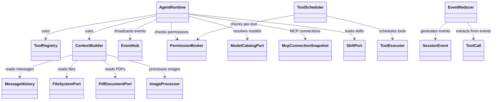
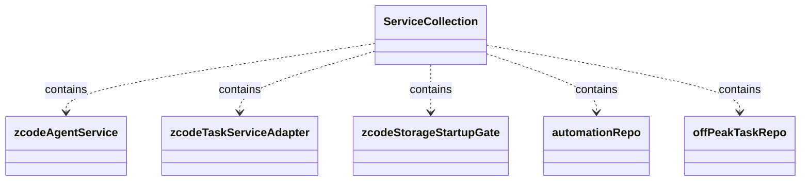
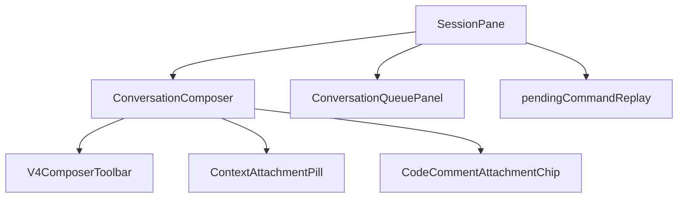
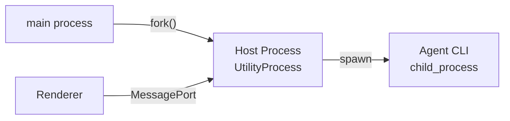

[上一篇](03-详细逐步说明-主链路拆解.md) · [总目录](README.md) · [下一篇](05-API与接口设计.md)

# 核心模块与类关系——ZCode 全部包的类型体系全景

> **场景**：让开发者了解每个包提供了哪些 Struct、Class、Enum、Trait/Interface、Type alias。
> **层级**：第四层——模块级 + 类型级
> **版本**：v1 (2026-09-23)
> **源码基准**：commit `872ad96`

---

## 1. @zcode/shared — 协议与共享类型

**文件：** `packages/shared/src/`  
**职责：** V4 协议定义、旧协议方法表、所有跨进程消息的类型契约

### 核心 Const / Enum

| 名称 | 类型 | 偏移 | 说明 |
|------|------|------|------|
| `zcodeProtocolMethods` | const object | ~+3560 | 旧协议方法族枚举 (session/*, workspace/*, mcp/list…) |
| `V4_METHODS` | const object | ~+307 | V4 协议方法前缀枚举 (v4/command, v4/conversation/*…) |
| `V4_NOTIFICATIONS` | const object | ~+382 | V4 通知类型常量 |
| `SessionEventType` | enum | shared-types | 会话事件类型枚举 (TurnStarted, TextDelta, TurnCompleted…) |
| `GoalStatus` | enum | shared-types | 目标状态枚举 |

### Trait / Interface

| 名称 | 文件 | 说明 |
|------|------|------|
| `ConversationTransport` | ui/v4/transport.ts | UI 到 Host 的命令发送接口 |
| `CommandPayloadMap` | shared/zcode-protocol-v4/transport.ts | V4 命令载荷映射表 |
| `CommandEnvelope` | shared/zcode-protocol-v4/transport.ts | V4 命令信封泛型类型 |
| `CommandAck` | shared/zcode-protocol-v4/transport.ts | V4 命令回执 |
| `AgentClient` | client/src/messageport.ts | RPC Client 抽象 |

### 依赖

```text
@zcode/shared
  → zod (runtime schema validation)
  → @zcode/contracts (types only from core)
```

---

## 2. @zcode/rpc — RPC 框架

**文件：** `packages/rpc/src/`  
**职责：** 基于 Electron MessagePort 的轻量 RPC 实现

### 核心 Class

| 名称 | 文件 | 说明 |
|------|------|------|
| `MessageChannel` | rpc/*.ts | 双向通道封装 |
| `ChannelServer` | rpc/channel-server.ts | RPC Server（路由 handler 注册） |
| `LoggingChannelServer` | rpc/*.ts | 带日志的 ChannelServer |
| `NetworkTelemetryChannelServer` | rpc/*.ts | 网络遥测专用 server |

### 调用关系

```text
MessageChannel ←→ ChannelServer
       ↓                  ↑
   Renderer          Host Process
```

---

## 3. @zcode/core — Agent 核心运行时

**文件：** `apps/zcode-cli/packages/core/src/`  
**职责：** LLM 调用循环、Tool 调度、Event Reduction、Context Building  
**文件数：** ~495 文件（最大单体业务逻辑包）

### 核心 Class：AgentRuntime

**文件：** `apps/zcode-cli/packages/core/src/runtime/agent-runtime.ts`  
**偏移：** +1～+664

**职责：** 会话生命周期管理 + turn admission + event hub + model execution

**构造函数参数 (AgentRuntimeConfig / AgentRuntimeDeps)：**

| 字段 | 类型 | 说明 |
|------|------|------|
| app | ZCodeApp | App 实例（含 sendInput、subscribeEvents） |
| sessionStore | SqliteSessionStore | SQLite 持久化 |
| contextBuilder | ContextBuilder | 上下文构建器 |
| toolRegistry | ToolRegistry | 工具注册表 |
| permissionBroker | PermissionBrokerPort | 权限代理 |
| eventHub | EventHub | 事件广播总线 |
| loggerFactory | LoggerFactory | 日志工厂 |
| ... | ... | 共 20+ 依赖项 |

**关键方法：**

| 方法 | 所属文件 | 偏移 | 说明 |
|------|---------|------|------|
| `admitPrompt` | methods/index.ts | ~+40 | 输入准入检查 |
| `subscribeEvents` | deps.ts (EventHub) | - | 事件订阅 |
| `continueActiveTargetLoop` | methods/* | - | 继续活跃目标轮次 |
| `stopActiveForegroundExecution` | methods/compact-active.ts | ~+40 | 停止前台执行 |
| `enqueueDeferredInput` | methods/compact-active.ts | - | 排队延迟输入 |

### 核心 Class：ToolScheduler

**文件：** `deps.ts` (from core)  
**职责：** 并行调度工具执行、收集结果、回传给 model step

### 核心 Class：ContextBuilder

**文件：** `context.ts` (~+200 lines)  
**职责：** 从 message history + system prompt 构建模型输入上下文

### 核心 Class：EventReducer

**文件：** `deps.ts` (from core)  
**职责：** 原始事件 → 结构化 SessionEvent 投影

### Class 关系图



---

## 4. @zcode/bootstrap — Agent CLI 启动编排

**文件：** `apps/zcode-cli/packages/bootstrap/src/`  
**职责：** Agent CLI 进程的完整初始化流水线

### 核心 Function

| 名称 | 文件 | 偏移 | 说明 |
|------|------|------|------|
| `runZCodeProtocolAgent` | zcode-protocol-entrypoint.ts | +82~+377 | 进程入口函数 |
| `createZCodeApp` | app/create-app.ts | ~+50~+200 | 构造 App 实例 |
| `prepareZCodeTelemetryEnv` | telemetry-bootstrap.ts | - | 配置遥测环境变量 |
| `shutdownZCodeTelemetry` | telemetry-bootstrap.ts | - | 优雅关闭遥测 |

### Class

| 名称 | 文件 | 说明 |
|------|------|------|
| `ZCodeProtocolAgentServer` | zcode-protocol/server.ts | V4 服务端（路由分发） |
| `ZCodeProtocolNdjsonConnection` | zcode-protocol/transport.ts | NDJSON stdin/stdout 管道 |
| `ZCodeApp` | app/types.ts | App 运行时对象 |
| `InputFacade` | app/input-facade.ts | Input 门面（sendInput/recordInputHistory） |

### 启动顺序

```
1. acquireProtocolStartupResource(sessionStore)     → open SQLite
2. startProcessProviderRegistryRuntime(runtimeEnv)   → Provider Registry
3. prepareZCodeTelemetryEnv()                        → Telemetry config
4. createMcpTelemetryTracker()                       → MCP 遥测
5. createOfficialMcpAuthHeadersPort()                → MCP auth
6. createMcpAdapterConnectionPool()                  → MCP pool
7. new ZCodeProtocolAgentServer(...)                 → V4 Server
8. createNodeReplBrowserBroker()                     → Browser broker
9. new ZCodeProtocolNdjsonConnection()               → Transport
10. connection.start()                               → Ready
11. await connection.waitForClose()                  ← blocks
12. finally cleanupProtocolRuntime()
```

---

## 5. @zcode/services — 业务服务层

**文件：** `packages/services/src/`  
**职责：** Host 进程中承载业务逻辑的服务集合  
**文件数：** ~301 文件

### 核心 Service：zcodeAgentService

**文件：** `packages/services/src/zcode-agent/zcodeAgentService.ts`  
**行数：** 5646

**职责：** Host 侧对 Agent CLI 的所有操作封装（RPC facade）

**关键方法：**

| 方法 | 偏移 | 说明 |
|------|------|------|
| `sendConversationCommandV4` | +5026 | 发送 V4 命令到 Agent |
| `queryConversationCommandsV4` | +5100 | 查询已执行命令列表 |
| `conversationRowsRangeV4` | +5120 | 分页读取会话行 |
| `unsubscribeConversationV4` | ~+4800 | 取消会话订阅 |
| `getV4Capability` | ~+4700 | 获取客户端能力集 |

### Core Service：zcodeTaskServiceAdapter

**文件：** `packages/services/src/zcode-agent/zcodeTaskServiceAdapter.ts`  
**行数：** 5737

**职责：** Legacy Protocol ↔ V4 Protocol 的桥梁 —— sendPrompt 方法根据是否有附件选择路径

**关键方法：**

| 方法 | 偏移 | 说明 |
|------|------|------|
| `sendPrompt` | ~+387 | 统一消息发送入口（分支到旧/V4） |
| `onSessionEvent` | ~+2800 | 会话事件回调 |
| `disconnect` | ~+4200 | 断开连接 |

### Service：session service / conversation store

**文件：** `packages/services/src/session/contract.ts`  
**职责：** 会话数据持久化和查询

### Service 继承/组合图



---

## 6. @zcode/ui — React UI 组件库

**文件：** `packages/ui/src/`  
**职责：** 共享 React 组件、hooks、Zustand store  
**文件数：** ~1,477 文件（最大前端代码包）

### 核心 Store：conversationProjectionStore

**文件：** `packages/ui/src/v4/conversationProjectionStore.ts`  
**职责：** 会话行数据的 Zustand store（投影计算核心）

**Key Actions：**

| Action | 偏移 | 说明 |
|--------|------|------|
| `appendRow` | ~+100 | 追加新行 |
| `updateRow` | ~+200 | 更新已有行 |
| `acceptModelSelection` | ~+300 | 记录用户选择 |
| `setPendingCommandAccepted` | ~+400 | 标记命令已接受 |

### Hook：useComposerAttachments

**文件：** `packages/ui/src/v4/composer/useComposerAttachments.ts`  
**偏移：** +1～+1051

**职责：** Composer 中附件上传的生命周期管理

### Hook：useDraftSessionPrewarm

**文件：** `packages/ui/src/v4/composer/useDraftSessionPrewarm.ts`  
**偏移：** +1～+504

**职责：** 新建会话前的草稿预热（提前创建空会话，减少首次交互等待）

### Component Tree



---

## 7. @zcode/desktop — Electron Desktop

**文件：** `packages/desktop/src/`  
**职责：** Electron Main + Host + Renderer 三端集成

### Main 进程核心

| 文件 | 偏移 | 职责 |
|------|------|------|
| `main/index.ts` | ~+1 | Electron main entry point |
| `desktopHostProcess.ts` | +151 | spawnHostProcess 函数（fork UtilityProcess） |
| `appLaunchCoordinator.ts` | ~+50 | 应用启动协调器 |

### Host 进程核心

| 文件 | 偏移 | 职责 |
|------|------|------|
| `host/index.ts` | ~+1 | Host 初始化编排 |
| `hostDatabaseStartup.ts` | ~+30 | 数据库连接准备 |
| `hostShutdownPhases.ts` | ~+50 | 关机阶段控制 |

### 调用关系



---

## 8. @zcode/cli — Agent CLI 命令行

**文件：** `apps/zcode-cli/packages/cli/src/`  
**职责：** 命令行入口和参数解析分发

### 核心 Entry Functions

| 函数 | 文件 | 偏移 | 说明 |
|------|------|------|------|
| `run` | run.ts | +286~+575 | CLI 统一入口 |
| `runTuiCommand` | tui-command.ts | ~+20 | TUI 模式启动 |
| `runZCodeProtocolCommand` | run.ts | +233~+284 | 协议服务端启动 |
| `runPrompt` | prompt-command.ts | ~+40 | 无头 prompt 模式 |

### 调用链

```text
run(ctx, deps)
  ├─ parseGlobalArgs(extracted.args)          // arguments.ts
  ├─ normalizeLocaleOption(value)              // locale handling
  ├─ resolveCliCwd()                           // cwd resolution
  ├─ switch(commandName(positionals)) {
       "tui"       → runTuiCommand()
       "login"     → runLoginCommand()
       "logout"    → runLogoutCommand()
       "doctor"    → runDoctor()
       "help"      → writeHelp()
       "plugins"   → runPluginsCommand()
       "commands"  → runCommandsCommand()
       "skills"    → runSkillsCommand()
       "app-server"→ runZCodeProtocolCommand()
       "agent-server" → runZCodeProtocolCommand()
       default     → error "Unknown command"
    }
```

---

## 9. @zcode/adapters — 环境适配器

**文件：** `apps/zcode-cli/packages/adapters/src/`  
**职责：** Core 对环境资源的抽象（fs、exec、http、mcp、model、auth…）

### 适配器分组

| 目录 | 职责 |
|------|------|
| `auth/` | 认证提供者 |
| `browser/` | 浏览器自动化（Playwright 等） |
| `commands/` | Slash commands / custom commands |
| `context/` | Prompt context building |
| `device/` | 设备指纹/MID |
| `exec/` | 外部进程执行（spawn wrapper） |
| `fs/` | 文件系统操作 |
| `http/` | HTTP 客户端 |
| `image/` | 图片处理 |
| `logging/` | 日志工厂 |
| `mcp/` | MCP 连接池/遥测 |
| `model/` | 模型 API 调用 |
| `network/` | 网络配置 |
| `pdf/` | PDF 文档读取 |
| `plugins/` | 插件加载器 |
| `provider/` | Provider 注册 |
| `skills/` | Skill 加载 |
| `storage/` | SQLite session store |
| `workflow/` | Workflow 管理 |

---

## 10. Provider & Provider Node

**文件：** `packages/provider/src/` + `packages/provider-node/src/`

### 核心关系

```text
Provider Registry (accounts + config)
  → provides available providers list
  → resolved by ModelSelectionFacade
  → instantiated as model endpoints (OpenAI compatible, Anthropic, etc.)
```

---

## 包间依赖矩阵（精简版）

```text
@zcode/cli        → @zcode/bootstrap, @zcode/core, @zcode/tui
                    ↓
@zcode/bootstrap  → @zcode/core, @zcode/adapters, @zcode/shared, @zcode/provider-node
                    ↓
@zcode/core       → @zcode/adapters (runtime deps), @zcode/shared-types (types)
                    ↓
@zcode/services   → @zcode/shared, @zcode/rpc
                    ↓
@zcode/ui         → @zcode/services (via useServices hook), @zcode/shared
                    ↓
@zcode/desktop    → @zcode/services, @zcode/shared, @zcode/rpc, @zcode/ui
                    ↓
@zcode/web        → @zcode/ui, @zcode/client, @zcode/shared
                    ↓
@zcode/server     → @zcode/services, @zcode/shared
```

---

[上一篇](03-详细逐步说明-主链路拆解.md) · [总目录](README.md) · [下一篇](05-API与接口设计.md)
