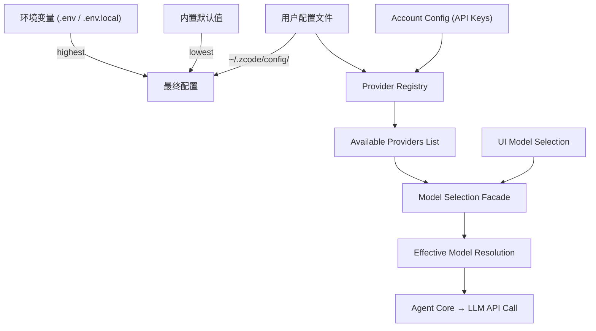
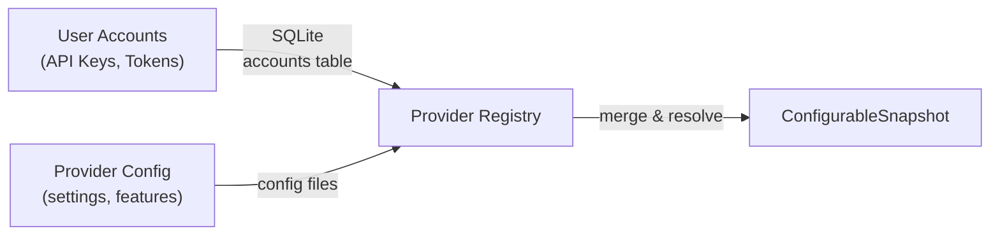
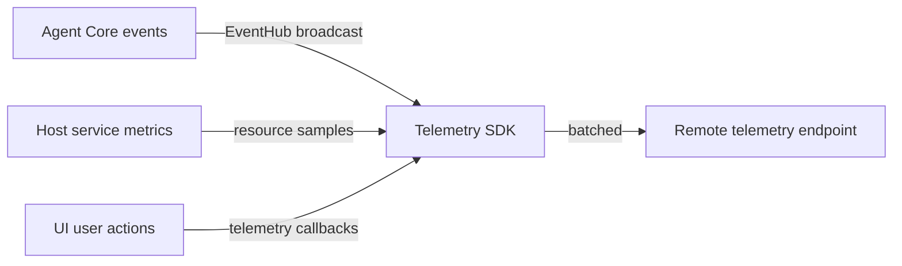
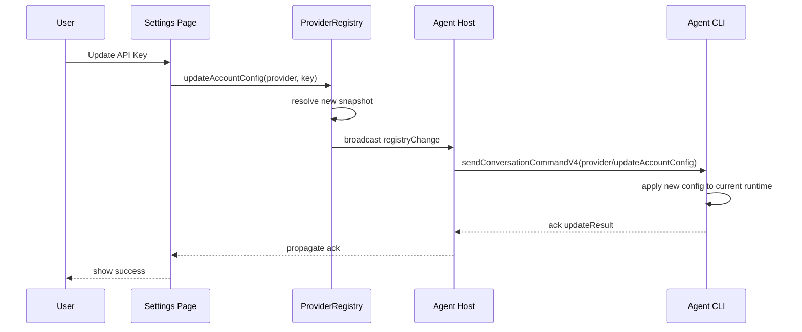
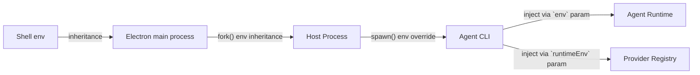

[上一篇](05-API与接口设计.md) · [总目录](README.md) · [下一篇](07-函数级源码解析-CLI-Bootstrap.md)

# 配置与数据流——Provider Registry、Model Selection、Session DB

> **场景**：描述系统关键配置数据的来源、流转、优先级和持久化路径。
> **层级**：第四层——配置 + 数据流文档
> **版本**：v1 (2026-09-23)
> **源码基准**：commit `872ad96`

---

## 1. 配置体系概述



### 配置层级（优先级从高到低）

```text
1. 环境变量 (process.env) — ZCODE_*, BASH_* 等
2. .env.local — 本地开发覆盖（不提交到 git）
3. .env — 项目环境配置
4. 用户配置 (~/.zcode/config/) — provider/account settings
5. 内置默认值 (config/README.md)
```

### 核心环境变量

| 变量 | 默认值 | 说明 |
|------|--------|------|
| `ZCODE_DATA_BASE_DIR` | `~/.zcode` | 应用数据根目录 |
| `ZCODE_SERVER_WORKSPACE` | `$PWD` | Web 后端工作区路径 |
| `ZCODE_BUILTIN_PROVIDER_CONFIG_FILE` | built-in | Provider 配置覆盖文件 |
| `ZCODE_DIST_BASE_URL` | placeholder | 命令行安装脚本下载地址 |
| `ZCODE_TELEMETRY_RUNTIME_SURFACE` | `desktop_local_host` | 遥测运行面标识 |
| `ZCODE_TELEMETRY_DEVICE_MID` | auto-generated | 设备唯一标识 |
| `ZCODE_APP_VERSION` | from package.json | 产品版本号 |
| `ELECTRON_MIRROR` | npmmirror.com | Electron 下载镜像 |
| `NODE_TLS_REJECT_UNAUTHORIZED` | -1 (dev only) | TLS 校验开关 |

---

## 2. Provider Registry 数据流

### 数据源



### Provider Registry 启动流程

**文件：** `apps/zcode-cli/packages/bootstrap/src/app/start-provider-registry.ts`  
**偏移：** ~+20～+100

```text
1. createConfig({ env })                              // 读取配置
2. resolveZCodeDataDir()                              // 确定数据目录
3. openDatabase(dbPath)                               // SQLite session store
4. startProcessProviderRegistryRuntime(runtimeEnv)     // see below
5. return { registryService, syncAccountProviderConfig, configuredDefaultModelSelection }
```

### Provider Registry Runtime

```typescript
type StartProviderRegistryRuntime = () => Promise<{
  runtime: RegistryService;
  syncAccountProviderConfig: SyncFn;
  configuredDefaultModelSelection?: ModelSelection;
}>
```

内部包含：
- `accountProviderConfigSyncer` — 同步账号配置（OAuth tokens, API keys）
- `providerRegistryRefreshLoop` — 定时刷新可用 provider 列表
- `configuredDefaultModelSelection` — 用户配置的默认模型选择

### Snapshot 结构

```typescript
interface ConfigurableSnapshot {
  providers: Provider[];           // resolved list from config + accounts
  configRevisions: ConfigRevisions;
  sourceRevisions: SourceRevisions;
  availableModels: ModelCatalog;
}
```

### 刷新策略

```text
Trigger: refresh(reason)
  ├─ reason === "manual"          → UI 手动触发
  ├─ reason === "config_change"   → 配置文件修改
  ├─ reason === "account_update"  → 账号凭证变更
  └─ reason === "periodic"        → 定时后台刷新
  
Action:
  1. Reload account config from disk (async)
  2. Merge with provider config
  3. Resolve OAuth tokens (if any)
  4. Validate connectivity to each provider
  5. Build new snapshot (immutable)
  6. Notify listeners of change
```

---

## 3. Model Selection Facade

**文件：** `packages/provider-node/src/model-selection-facade.ts`  
**偏移：** +20～+150

### 核心逻辑

```text
createNodeModelSelectionFacade(registryService)
  ↓
modelSelectionFacade.getView(selection, modelPreference?, options?)
  ↓
返回 { effectiveSelection, selectionIssue? }

其中：
effectiveSelection = { provider, model } 或 null
selectionIssue = "no_available_models" | "model_not_found" | ...
```

### 决策树

```text
用户指定了 explicit selection?
  ├─ Yes → validate against available models
  │         ├─ exists → return { effectiveSelection }
  │         └─ not found → throw Error("model.invalid")
  └─ No → use configured default model
          ├─ defined → return { effectiveSelection }
          └─ undefined → throw Error("model.no_default")
```

### 调用点

```text
Agent CLI bootstrap:
  → createNodeModelSelectionFacade(registryService)
  → resolveEffectiveModelSelection(selection) { ... }
  → injected into ZCodeProtocolAgentServer

Desktop/UI:
  → ModelSelectionContext.use() (React hook)
  → used in ConversationComposer for model picker
```

---

## 4. Session Database (SQLite)

### 数据库位置

```
macOS/Linux:  ~/.zcode/data/<workspaceKey>/sessions.db
Windows:      %APPDATA%/.zcode/data/<workspaceKey>/sessions.db
Dev mode:     $ZCODE_DATA_BASE_DIR/.zcode/data/<workspaceKey>/sessions.db
```

### Schema 概要

| 表名 | 用途 | 主键 |
|------|------|------|
| sessions | 会话元数据 | id (UUID) |
| messages | 消息内容 | id |
| turn_usage | 轮次 Token 用量 | turn_id |
| model_usage | 模型 Token 聚合 | session_id |
| attachments | 附件信息 | id |
| hooks_trust_reviews | Hook 信任审核记录 | id |
| plugin_manifests | 插件清单缓存 | plugin_id |

### 核心查询模式

```sql
-- 获取会话列表（含最新活动时间排序）
SELECT id, title, updated_at FROM sessions WHERE workspace_key = ? ORDER BY updated_at DESC;

-- 获取会话消息分页
SELECT * FROM messages WHERE session_id = ? AND row_id > ? LIMIT ?;

-- 获取会话上下文快照
SELECT snapshot FROM sessions WHERE id = ?;
```

### Session Store 适配器

**文件：** `apps/zcode-cli/packages/adapters/src/storage/session-store/repositories/*.ts`

```typescript
interface SqliteSessionStore {
  createSession(session: SessionInsert): Promise<Session>;
  updateSession(id: string, patch: SessionPatch): Promise<void>;
  deleteSession(id: string): Promise<void>;
  getSession(id: string): Promise<Session | null>;
  getSessionsByWorkspace(workspaceKey: string): Promise<Session[]>;
  
  // Message CRUD
  insertMessage(msg: MessageInsert): Promise<Message>;
  getMessagesPaginated(sessionId: string, params: PaginationParams): Promise<MessagePage>;
  
  // Turn stats
  upsertTurnUsage(usage: TurnUsageInsert): Promise<void>;
  getModelUsageStats(sessionId: string): Promise<ModelUsageStats>;
}
```

---

## 5. Workspace Identity

### 构造规则

```typescript
// 统一 identity key 公式（见 AGENTS.md）
const workspaceKey = workspaceIdentity?.trim() || workspacePath;
```

### 使用场景

| 模块 | 用法 | 目的 |
|------|------|------|
| sessionStore | `dbPath = join(ZCODE_DATA_BASE_DIR, '.zcode', 'data', workspaceKey)` | 隔离不同 workspace 的会话 |
| zcodeTaskServiceAdapter | `resolveWorkspaceKey(target)` | audit log reconciliation |
| CommandInbox | queueItemId generation | per-workspace command dedup |
| Plugin Management | `pluginsPath = join(dataDir, 'plugins', workspaceKey)` | 插件按 workspace 安装 |
| MCP Auth | `workspaceKey` in auth header resolution | per-workspace credential isolation |

---

## 6. Telemetry Data Flow



### 收集项

| 类别 | 数据 | 频率 |
|------|------|------|
| Runtime events | TurnStarted, TextDelta, ToolCall, TurnCompleted | event-driven |
| Resource usage | CPU%, Memory RSS, Disk I/O | sampling (every few seconds) |
| MCP telemetry | tool_call latency, error rate | event-driven |
| Connection stats | reconnection count, latency p99 | periodic summary |
| User interactions | model selection change, command dispatch | event-driven |

### 设备 MID 生成

```typescript
prepareZCodeTelemetryEnv(runtimeEnv, { cliVersion, productVersion })
  ↓
if env.ZCODE_TELEMETRY_DEVICE_MID exists
  → reuse existing MID
else
  → generate UUID v4 → persist to ~/.zcode/data/device-mid.txt
  → set in env
```

---

## 7. 配置变更事件传播



---

## 8. 环境变量注入链



### Agent CLI 接收到的环境变量

| 来源 | 变量 |
|------|------|
| Shell | PATH, HOME, USER, NVM_* 等 |
| Environment | ZCODE_*, ELECTRON_* 等 |
| Bootstrap injected | ZCODE_TELEMETRY_DEVICE_MID, ZCODE_APP_VERSION |
| Session-scoped | ZCODE_WORKSPACE_IDENTITY, ZCODE_SESSION_ID |

### Provider Registry Runtime Env

```typescript
startProcessProviderRegistryRuntime(runtimeEnv) {
  // runtimeEnv is either process.env or a custom object passed from caller
  const configResult = createConfig({ env: runtimeEnv });
  // Uses env vars for proxy, CA cert, noProxy paths...
}
```

---

## 9. 文件路径汇总

| 类型 | 路径 | 说明 |
|------|------|------|
| App data root | `~/.zcode/` or `$ZCODE_DATA_BASE_DIR/.zcode/` | All app files under this |
| Session DB | `~/.zcode/data/<key>/sessions.db` | SQLite |
| Plugin storage | `~/.zcode/plugins/<source>/<pluginId>` | Per-source plugins |
| Config | `~/.zcode/config/providers.json` | Provider config |
| Device MID | `~/.zcode/data/device-mid.txt` | Telemetry device ID |
| Logs | `~/.zcode/logs/` | Application logs |

---

[上一篇](05-API与接口设计.md) · [总目录](README.md) · [下一篇](07-函数级源码解析-CLI-Bootstrap.md)
