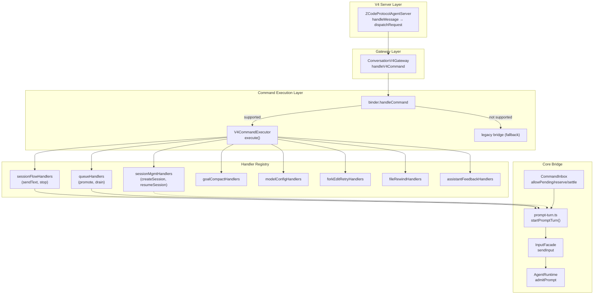

[上一篇](07-函数级源码解析-CLI-Bootstrap.md) · [总目录](README.md) · [下一篇](09-函数级源码解析-Core-AgentRuntime.md)

# V4 CommandExecutor——V4命令执行器 + Handler注册表 + prompt-turn + CommandInbox

> **场景**：解析 "v4/command" 方法到达的 envelope → 路由到具体 handler → 执行 core admission → 返回 CommandAck。
> **层级**：第四层——函数级源码解析
> **版本**：v1 (2026-09-23)
> **源码基准**：commit `872ad96`

---

## 类：V4CommandExecutor

**文件：** `apps/zcode-cli/packages/bootstrap/src/zcode-protocol-v4/commands/executor.ts`  
**所属：** `class V4CommandExecutor`  
**职责：** V4 原生命令的执行中枢——将命令类型路由到对应 handler  
**构造函数参数：**

| 参数 | 类型 | 说明 |
|------|------|------|
| host | `V4CommandCoreHost` | Core 能力宿主（session record lookup, ensureModelReady 等） |

### 方法：supports

**偏移：** +35～+37

```text
function supports(type: CommandEnvelope["type"]): boolean {
  return type in NATIVE_HANDLERS;
}
```

作用：binder 据此判断当前命令是否已原生化（未命中 → 回落旧桥）。

### 方法：execute

**偏移：** +39～+60

**参数：**
```typescript
envelope: CommandEnvelope
admission?: V4CommandAdmission       // { admissionSeq, admittedAt, queueItemId }
executionContext?: V4CommandExecutionContext  // { autoDrainPromotion? }
```

**返回值：** `Promise<CommandResult | undefined>`

**内部逻辑：**

```text
1. guard selection_side_chat restricted commands
   if (sessionId && SELECTION_SIDE_CHAT_RESTRICTED_COMMANDS.has(type) &&
       taskType === "selection_side_chat") {
     throw new V4SelectionSideChatRestrictedCommandError(type)
   }

2. handler lookup
   handler = NATIVE_HANDLERS[type as keyof typeof NATIVE_HANDLERS]
   
3. if !handler → throw Error("v4 native executor does not support: ...")
   
4. execute handler(host, enriched envelope)
   return handler(host, {
     ...envelope,
     __v4Admission: admission,
     __v4ExecutionContext: executionContext
   })
```

### 调用关系

```text
ZCodeProtocolAgentServer.dispatchRequest()
    ↓ (switch case V4_METHODS.command)
ConversationV4Gateway.handleV4Command()
    ↓
binder.handleCommand(envelope)
    ↓
if binder.supports(type) → V4CommandExecutor.execute(envelope)
else → legacy bridge fallback
```

---

## Const：NATIVE_HANDLERS

**文件：** `apps/zcode-cli/packages/bootstrap/src/zcode-protocol-v4/commands/handlers/index.ts`  
**偏移：** +15～+26

**定义：**

```typescript
export const NATIVE_HANDLERS = {
  ...sessionFlowHandlers,              // sendText, stop
  ...queueHandlers,                    // startPromptTurn, promotion, drain
  ...sessionMgmtHandlers,              // createSession, resumeSession
  ...selectionSideSessionHandlers,     // selection side session ops
  ...goalCompactHandlers,              // compact, goalState
  ...modelConfigHandlers,              // switchModel, setThoughtLevel
  ...interactionBackgroundHandlers,    // interaction background ops
  ...forkEditRetryHandlers,            // fork, edit, retry
  ...fileRewindHandlers,               // rewind preview/apply
  ...assistantFeedbackHandlers,        // assistant feedback
}
```

每个分组导出一个对象 spread 进最终注册表。

---

## 模块：sessionFlowHandlers — sendText / stop

**文件：** `apps/zcode-cli/packages/bootstrap/src/zcode-protocol-v4/commands/handlers/session-flow.ts`  
**行数：** ~440

### 函数：sendText

**偏移：** +184～+301

**职责：** V4 sendText 处理——校验输入、处理 held queue、抢占前台租约、启动 turn  
**调用者：** `V4CommandExecutor.execute()`

**参数：**
```typescript
host: V4CommandCoreHost
envelope: CommandEnvelope & { type: "sendText", payload: CommandPayloadMap["sendText"] }
```

**返回值：** `Promise<CommandResult | undefined>` (inputAccepted / inputRejected)

**内部逻辑：**

```text
├── 1. Payload extraction (+188)
│      payload = envelope.payload as CommandPayloadMap["sendText"]
│
├── 2. Record validation (+189)
│      record = requireRecord(host, envelope.sessionId)
│      → record exists or throw V4SessionNotFoundError
│
├── 3. Input non-empty check (+191~+193)
│      hasPromptInput(payload.text, payload.attachments)
│      → !hasPromptInput → throw V4InputAdmissionRejectedError
│
├── 4. Attachment mapping (+194)
│      attachments = await mapAttachmentRefsToTurnAttachments(record.app, payload.attachments)
│      → 冷恢复后需要加载附件实际内容（AttachmentRef → TurnAttachment）
│
├── 5. Execution state resolution (+195)
│      submittedExecutionState = resolveSubmittedExecutionState(record, payload)
│
├── 6. Intent construction (+196~+197)
│      submissionIntent = options => inputIntentMetadata(envelope, {...})
│
├── 7. Routing mode inspection (+198)
│      routingMode = host.getInputRoutingMode?.(record.sessionId ?? "") ?? null
│      → "guide" | "enqueue" | null (normal)
│
├── 8. Foreground promotion lease (forceStartNow path) (+199~+241)
│      foregroundPromotionLeaseId = "send-now:" + commandId
│      leaseResult = record.app.runtime.acquireForegroundPromotionLease({
│        leaseId, mode: "after-current", promotedInputId: commandId
│      })
│      → kind !== "acquired" → throw busy error
│      try {
│        applyHeldQueueDisposition(...)          // applied before preempt
│        preempted = await preemptActiveTurnAndWait(host, record, ...)
│      } catch { releaseForegroundPromotionLease(); throw }
│
├── 9. Held queue disposition (non-forceStartNow path) (+243~+249)
│      applyHeldQueueDisposition(host, record, payload.heldQueueDisposition, expectedIds)
│
├── 10. Build intent + call startPromptTurn (+254~+285)
│       intent = submissionIntent({
│         text, requestedDelivery, attachmentRefs, sharedContextRefs, ...
│       })
│       started = await startPromptTurn(host, record, {
│         content: payload.text,
│         inputId: envelope.commandId,
│         browserAmbientContext: payload.browserAmbientContext,
│         inputPresentation: preempted && !attachments ? "user_steer" : undefined,
│         intent, modelExecution, attachments, toolDisallowlist,
│         ...(forceStartNow ? { requireIdle: true } : {}),
│         ...turnBackgroundAttributionOf(payload)
│       })
│
└── 11. Return ACK (+289~+300)
        if started.admission.kind === "queued":
          return { type: "inputAccepted", delivery: "queue", inputId }
        else:
          return { type: "inputAccepted", delivery: "startNow", inputId }
```

**关键状态变化：**
```text
Before sendText:
  record.activeAutomationId = old_value
  record.activeOffPeakTaskId = old_value
After sendText:
  → set to undefined in clearPromptRecordState (on error or completion)
```

### 函数：stop

**偏移：** +303～+320

**职责：** 精确取消前台执行（不杀整个 turn，只停当前 tool/model call）  
**参数：**
```typescript
host: V4CommandCoreHost
envelope: CommandEnvelope & { type: "stop", payload: CommandPayloadMap["stop"] }
```

**内部逻辑：**

```text
1. record = requireRecord(host, envelope.sessionId)
2. runtimeStop = record.app.runtime?.stopActiveForegroundExecution?.({
     expectedForegroundExecutionId: payload.expectedForegroundExecutionId,
     reason: "v4 session stopped"
   })
3. host.logger?.info("v4 stop foreground execution inspected", ...)
4. Return ack with status determined by runtimeStop result
```

### export 对象

**偏移：** +439

```typescript
export const sessionFlowHandlers = { sendText, stop };
```

---

## 模块：queueHandlers — 队列管理

**文件：** `apps/zcode-cli/packages/bootstrap/src/zcode-protocol-v4/commands/handlers/queue.ts`  
**职责：** 后台任务派发、闲时轮管理、drain deferred inputs

### 函数：startPromptTurn (queue variant)

**偏移：** ~+20～+80

**职责：** 调度器触发的排队输入转正常 turn

**调用者：** `offpeak-port` / `automation-tool-policy` (定时触发器)

### 函数：promoteToForeground

**偏移：** ~+80～+150

**职责：** 将 queued 输入提升为 startNow（持有 lease 的后台任务完成时调用）

**调用者：** `CommandInbox.reserveForBackgroundTask()` 完成后回调

---

## 模块：sessionMgmtHandlers — 会话生命周期

**文件：** `apps/zode-cli/packages/bootstrap/src/zcode-protocol-v4/commands/handlers/session-mgmt.ts`  
**职责：** 创建/恢复/删除/列出会话

### 函数：createSession

**偏移：** ~+10～+60

**职责：** 新建空会话并记录  
**注意：** `firstInput` 可选——有则经原生 prompt turn 提交（与 sendText 同一条写路径）

**内部逻辑：**

```text
1. record = sessionMgmt.createSession(params)
2. if params.firstInput:
     return startPromptTurn(record, params.firstInput)  // reuse sendText path
   else:
     return { ack, initialWires }  // just acknowledge
```

### 函数：resumeSession

**偏移：** ~+60～+120

**职责：** 从持久化快照恢复已关闭会话到内存  
**调用者：** Host 端的 cold-file-change-summaries 触发

### 函数：deleteSession

**偏移：** ~+120～+180

**职责：** 彻底删除会话数据（SQLite purge）

---

## 函数：startPromptTurn (prompt-turn module)

**文件：** `apps/zcode-cli/packages/bootstrap/src/zcode-protocol-v4/commands/prompt-turn.ts`  
**函数：** startPromptTurn  
**偏移：** +57～+177

**职责：** 入口只做模型/持久化前置校验，然后调用 app → Core admission  
**核心设计原则：** Admission receipt 立即返回；后台 completion promise 由 runWithSessionResidencyFinalization 接管清理

### 参数

```typescript
host: V4CommandCoreHost
record: V4SessionRecordView
params: StartPromptTurnParams {
  content: string,           // user's typed text
  inputId: string,           // commandId = queryId for audit reconciliation
  inputPresentation?: string, // "user_steer" when preemption happened
  attachments?: TurnAttachment[],  // resolved from refs
  browserAmbientContext?: object,
  intent: TurnInputIntentMetadata,
  modelExecution?: SelectionScope | ...,
  sharedContextRefs?: SharedContextRef[],
  toolDisallowlist?: readonly string[],
  requireIdle?: boolean,     // forceIdle admission requirement
  automationId?, offPeakTaskId?, offPeakRunType?,
}
```

### 返回值

```typescript
Promise<PromptTurnStartResult>
{
  admission: SendInputResult,     // { kind: "started_turn"|"queued"|"rejected", ... }
  turnStarted: Promise<void>,     // Core admission completed (always resolve)
  completion?: Promise<unknown>,   // background cleanup only (not ACK boundary)
  messageId?: string,             // deprecated, kept for compat
}
```

### 内部逻辑（逐段）

```text
├── A. Model readiness check (+62~+83)
│      usesExecutionSelection = params.modelExecution?.selectionScope === "execution"
│      if (!usesExecutionSelection && record.restoreWarning) {
│        → host.hasUsableRuntimeModelTarget?.(record) === true ? clear warning
│        → else → throw restoreWarning
│      }
│      if (!usesExecutionSelection) {
│        await host.ensureModelReady?.(record)
│      }
│
├── B. Persistence upgrade (+84)
│      if (record.persistence === "deferred") record.persistence = "immediate"
│      → 首次发送提升持久化等级，后续事件会落盘 SQLite
│
├── C. Automation/OffPeak tracking (+86~+99)
│      previousAutomationId = record.activeAutomationId
│      previousOffPeakTaskId = record.activeOffPeakTaskId
│      activeAutomationId = resolveTurnAutomationId(params)
│      activeOffPeakTaskId = resolveTurnOffPeakTaskId(params)
│      if (activeAutomationId) record.activeAutomationId = activeAutomationId
│      if (activeOffPeakTaskId) record.activeOffPeakTaskId = activeOffPeakTaskId
│
│      Tool disallowlist build (+90~+94)
│      turnToolDisallowlist = buildTurnToolDisallowlist(params, automationId, offPeakTaskId)
│      → automation: add CronCreate/CronUpdate/CronDelete (prevent mutation tools)
│      → offpeak: add OffPeakCreate/SendMessage/Workflow (prevent self-recursion)
│
├── D. Core admission via InputFacade (+101~+138)
│      admission = await record.app.sendInput(
│        { text: params.content, ...(attachments ? { attachments } : {}) },
│        {
│          delivery: "start_turn",
│          ...(intent.requestedDelivery === "guide" ? { queueDelivery: "guide" } : {}),
│          ...(browserAmbientContext ? { browserAmbientContext } : {}),
│          inputId: params.inputId,
│          ...(inputPresentation ? { inputPresentation } : {}),
│          ...turnBackgroundAttributionOf({ automationId, offPeakTaskId, offPeakRunType }),
│          intent: params.intent,
│          ...(modelExecution ? { modelExecution } : {}),
│          ...(sharedContextRefs ? { sharedContextRefs } : {}),
│          ...(toolDisallowlist ? { toolDisallowlist } : {}),
│          ...(requireIdle ? { requireIdle: true } : {}),
│          queryId: params.inputId,
│        }
│      )
│
│      If error during admission (+134~+138):
│        clearPromptRecordState(record, prevAuto, prevOffPeak)
│        host.afterLegacyStateMutation?.(record, "prompt_failed")
│        throw error
│
├── E. Admission rejection (+140~+146)
│      if (admission.kind === "rejected") {
│        clearPromptRecordState(record, prevAuto, prevOffPeak)
│        throw new V4PromptRejectedError("activePrompt", reason)
│      }
│
├── F. Queued handling (+148~+150)
│      if (admission.kind === "queued") {
│        clearPromptRecordState(record, prevAuto, prevOffPeak)
│        return { admission, turnStarted: Promise.resolve() }
│        → No completion promise: queue item will be drained later
│
└── G. Started turn + background completion (+153~+177)
       completion = runWithSessionResidencyFinalization(record, async () => {
         let mutationReason = "prompt_completed"
         try {
           await admission.completion
         } catch (error) {
           mutationReason = "prompt_failed"
           host.logger?.warn("v4 background turn failed", { ... })
         } finally {
           clearPromptRecordState(record, prevAuto, prevOffPeak)
           host.afterLegacyStateMutation?.(record, mutationReason)
         }
       })
       void completion.catch(() => undefined)  // swallow unexpected errors
       
       host.logger?.info("v4 prompt admitted", {
         attachmentCount, inputId, sessionId, textLength
       })
       
       return { admission, completion, turnStarted: Promise.resolve() }
```

### 辅助函数

#### resolveTurnAutomationId

**偏移：** +207～+217

```text
function resolveTurnAutomationId(params): string | undefined {
  explicit = params.automationId?.trim()
  if (explicit) return explicit
  
  inputId = params.inputId.trim()
  if (!inputId.startsWith("automation-")) return undefined
  separatorIndex = inputId.indexOf(":")
  automationId = separatorIndex >= 0 ? inputId.slice(0, separatorIndex) : inputId
  return automationId.length > AUTOMATION_INPUT_ID_PREFIX.length ? automationId : undefined
}
```

#### resolveTurnOffPeakTaskId

**偏移：** +219～+231

```text
function resolveTurnOffPeakTaskId(params): string | undefined {
  explicit = params.offPeakTaskId?.trim()
  if (explicit) return explicit
  
  inputId = params.inputId.trim()
  if (!inputId.startsWith("offpeak-")) return undefined
  separatorIndex = inputId.indexOf(":")
  offPeakTaskId = separatorIndex >= 0 ? inputId.slice(0, separatorIndex) : inputId
  return offPeakTaskId.length > OFF_PEAK_INPUT_ID_PREFIX.length ? offPeakTaskId : undefined
}
```

#### turnBackgroundAttributionOf

**偏移：** +233～+246

用于确定 turn 归因标识（自动化还是闲时任务），影响 tool disallowlist 构建。

#### buildTurnToolDisallowlist

**偏移：** +189～+205

```text
tools = Set(params.toolDisallowlist ?? [])
if (automationId) tools.add(CronCreate, CronUpdate, CronDelete)  // no cron mutations
if (offPeakTaskId) tools.add(OffPeakCreate, SendMessage, Workflow)  // prevent self-recursion
return tools.size > 0 ? [...tools] : undefined
```

---

## 类：CommandInbox

**文件：** `apps/zcode-cli/packages/bootstrap/src/zcode-protocol-v4/command-inbox.ts`  
**职责：** 统一命令 admission 与查询入口——三类事实严格分离  
**偏移：** +15～+170+

### Guard 裁决结果

**偏移：** +20～+23

```typescript
type GuardDecision =
  | { verdict: "allow" }
  | { verdict: "stale"; reasonCode: string; message?: string }
  | { verdict: "reject"; reasonCode: string; message?: string }
  | { verdict: "noop"; reasonCode: string; result?: CommandAck["result"] }
```

### CommandInboxHost interface

**偏移：** +31～+47

```typescript
interface CommandInboxHost {
  getRevision(sessionId: string): number | null       // CAS version
  getLogEpoch(sessionId: string): string | null       // epoch for CAS
  validateRowTarget?(envelope): GuardDecision          // entity/action resolver
  guard?(envelope): GuardDecision                      // product-protocol guard
  lookupTranscriptCommand?: PersistentLookup           // sourceCommandId lookup
  lookupTimelineCommand?: PersistentLookup
  lookupChildCommand?: PersistentLookup
  lookupDiscardedCommand?: PersistentLookup
  now?(): number                                        // optional clock
}
```

### InFlightEntry / LiveInputEntry / PendingInputEntry

**偏移：** +73～+82

```typescript
interface InFlightEntry {
  ack: CommandAck;
  final: Promise<CommandAck>;
  resolveFinal: (ack: CommandAck) => void;
}

interface LiveInputEntry {
  ack: CommandAck;
  intent: ConversationInputIntent;
}
```

### 核心规则

```
in-flight commands → always pinned (never evicted)
live inputs        → always pinned (waiting for user response)
settled commands   → enter 512 entry/session LRU cache
```

### 主要方法

| 方法 | 偏移 | 职责 |
|------|------|------|
| reserve(inflight) | ~+200 | 为 in-flight 命令获取锁 |
| allowPending(input) | ~+300 | 接受新的 pending 输入 |
| cancel(commandKey) | ~+400 | 撤销 pending 请求 |
| settleSettled(result) | ~+500 | 更新 settled 条目 |
| isPinned(key) | ~+600 | 检查命令是否被 pin |
| peekQueued() | ~+700 | 查询队列头 |

### 调用关系

```text
ConversationV4Gateway → CommandInbox.allowPending(input)
  ↓ (check all lookups)
Guards: transcript / timeline / child / discarded
  ↓
verdict: "allow" | "stale" | "reject" | "noop"
  ↓
if "allow": create LiveInputEntry → push to live queue
if "reject"/"stale": resolve Final promise with rejection
```

---

## 函数：commandAdmissionOf / commandExecutionContextOf

**文件：** `apps/zcode-cli/packages/bootstrap/src/zcode-protocol-v4/commands/executor.ts`  
**偏移：** +79～+93

**用途：** 从 envelope 中提取隐藏的 admission/execution context 标记

```typescript
export function commandAdmissionOf(envelope): V4CommandAdmission {
  return (
    (envelope as V4AdmittedCommandEnvelope).__v4Admission ?? {
      admissionSeq: 0,
      admittedAt: Date.now(),
      queueItemId: `queue_${envelope.commandId}`,
    }
  )
}

export function commandExecutionContextOf(envelope): V4CommandExecutionContext | undefined {
  return (envelope as V4AdmittedCommandEnvelope).__v4ExecutionContext
}
```

这些字段不在 wire 帧中传输，而是在内部传递时注入（`__v4Admission` 和 `__v4ExecutionContext` 属性）。

---

## 模块关系总结



---

[上一篇](07-函数级源码解析-CLI-Bootstrap.md) · [总目录](README.md) · [下一篇](09-函数级源码解析-Core-AgentRuntime.md)
