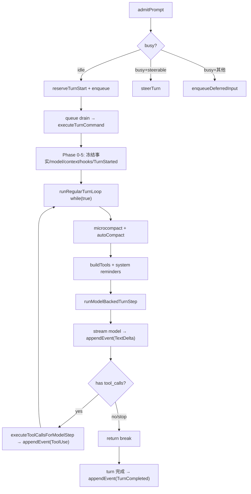

[上一篇](08-函数级源码解析-CLI-V4-CommandExecutor.md) · [总目录](README.md) · [下一篇](10-函数级源码解析-Host-ServiceAdapter.md)

# Core AgentRuntime——admitPrompt → turn loop → model step → tool 执行

> **场景**：Core 接收已准入的 prompt，驱动「模型调用 ↔ 工具执行」循环直到 turn 完成。
> **层级**：第四层——函数级源码解析
> **版本**：v1 (2026-09-23)
> **源码基准**：commit `872ad96`
> **说明**：AgentRuntime 采用 prototype 方法混入模式——`runtime/methods/index.ts` 的 `installAgentRuntimeMethods` 把各 method 挂到 `proto`（见 methods/index.ts +330: `proto.admitPrompt = admitPrompt`），方法内 `this: AgentRuntimeInternal`。

---

## 类：AgentRuntime

**文件：** `apps/zcode-cli/packages/core/src/runtime/agent-runtime.ts`  
**偏移：** +1～+664  
**职责：** 单会话的运行时核心——持有 turn 状态、model 执行、工具调度、事件流、权限检查、context 管理

**关键内部状态字段（由 interface 声明）：**

| 字段 | 说明 |
|------|------|
| `activeTurn` | 当前运行中 turn（存在 = turn busy） |
| `activeTurnStartReservation` | turn 启动预留（防并发第二条 turn） |
| `runtimeCommandQueue` | FIFO 运行时命令队列 |
| `runtimeCommandDrainActive` | 队列 drain 进行中标志 |
| `foregroundPromotionLease` | 前台提升租约（send-now 抢占用） |
| `activeForegroundExecution` | 当前前台执行（model/tool call 级） |
| `turnNumber` | 轮次计数 |
| `contextInitialized` | 首轮 context 是否已构建 |
| `rootTraceContext` | 根 trace context |

---

## 函数：admitPrompt

**文件：** `apps/zcode-cli/packages/core/src/runtime/methods/prompt-admission.ts`  
**所属：** `proto.admitPrompt`（混入 AgentRuntime）  
**偏移：** +20～+126  
**职责：** 每个 AgentRuntime 自己完成 prompt 的 admission——检查 busy 边界、建立 reservation、把 command 放进该 runtime 的 FIFO  
**调用方：** `InputFacade.sendInput` → `deps.runtime.admitPrompt(...)`

### 设计约束（源码注释 +15~+19）

> "Bootstrap 不应把这些步骤拆开，否则 reservation 建立前的异步窗口会让同一 session 产生第二条 turn。"

这是理解 Core admission 的钥匙：**busy 判定 + reservation 建立 + 入队三步必须原子**，都收在 Core 内部。

### 参数

| 参数 | 类型 | 说明 |
|------|------|------|
| input | string | 用户输入文本 |
| attachments | TurnState["attachments"] | 可选附件 |
| options | PromptAdmissionOptions | 含 requireIdle/delivery/queueDelivery/modelExecution/inputId/queryId/intent/toolDisallowlist/traceContext |

### 返回值

`Promise<PromptAdmissionReceipt>`——三种 `kind`：`"started"` | `"queued"` | `"rejected"`

### 执行流程（逐分支）

```text
函数：admitPrompt

├── 1. promotionLeaseOnly 判定 (+26~+33)
│       promotionLeaseOnly = requireIdle === true
│         && foregroundPromotionLease !== undefined
│         && activeForegroundExecution === undefined
│         && runtimeCommandDrainActive === false
│         && runtimeCommandQueue.hasPending() === false
│         && activeTurn === undefined
│         && activeTurnStartReservation === undefined
│       → 用于 send-now：持有前台租约但 Core 已实际空闲，视为可立即启动
│
├── 2. busy = hasActiveOrQueuedTurnWork() && !promotionLeaseOnly  (+34)
│
├── 3. if busy 分支 (+35~+84)
│   │
│   ├── 3a. requireIdle || modelExecution → rejected (+36~+42)
│   │       return { kind: "rejected", reason: activeTurn ? "turn_not_steerable" : "no_active_turn" }
│   │       → startNow 抢占失败 / 单次执行模型不能插队
│   │
│   ├── 3b. canSteer 判定 (+45~+51)
│   │       canSteer = attachments === undefined
│   │         && activeTurn?.steerable === true
│   │         && (queueDelivery==="guide" || delivery==="auto" || delivery==="steer_active_turn")
│   │         && queueDelivery !== "queue"
│   │       → 纯文本 + 可转向的 active turn → steer 注入当前轮
│   │       if canSteer: return await steerTurn({...})  (+52~+67)
│   │
│   └── 3c. 否则入队 (+69~+83)
│           delivery = queueDelivery==="guide" && 无附件 ? "guide" : "queue"
│           return await enqueueDeferredInput({...})
│           → 排队，turn 结束后 drain
│
└── 4. not busy 分支 → 立即启动 (+86~+125)
    ├── 4a. 生成 id (+86~+93)
    │       queryId = options.queryId ?? options.inputId ?? createQueryId()
    │       turnId = createTurnId()
    │       turnTraceContext = createChildTraceContext(root, { queryId, sessionId, turnId, attributes })
    │
    ├── 4b. 建立 reservation (+94~+99)  ★原子边界
    │       reservation = { kind: "regular", traceContext, turnId }
    │       this.reserveTurnStart(turnId, turnTraceContext, "regular")
    │       → 从此刻起同 session 第二次 start 会被 busy 挡住
    │
    ├── 4c. 入队可取消命令 (+101~+122)
    │       completion = enqueueCancellableRuntimeCommand(this, {
    │         abortSignal,
    │         onCommandCancelled: () => releaseTurnStart(turnId),
    │         createCommand: ({ reject, resolve }) => ({
    │           attachments, createdAt, id: createRuntimeCommandId(),
    │           input, mode: "prompt", options: {...executeOptions, queryId, traceContext},
    │           priority: "next", reject, resolve,
    │           startReservation: reservation, traceContext: turnTraceContext,
    │         })
    │       })
    │
    └── 4d. return { completion, kind: "started", turnId }  (+125)
            → 注释 (+123): admission 已完成；执行失败由 turn 事件消费，不制造 unhandled rejection
            void completion.catch(() => undefined)
```

### 调用关系

```text
InputFacade.sendInput (input-facade.ts +216)
    ↓
AgentRuntime.admitPrompt (prompt-admission.ts +20)
    ├── busy? → steerTurn (steering.ts)        [注入当前轮]
    ├── busy? → enqueueDeferredInput (steering.ts)  [排队]
    └── idle? → reserveTurnStart + enqueueCancellableRuntimeCommand
                     ↓ (queue drains)
                executeTurnCommand (turn.ts +93)   [实际执行]
```

### 关键设计点

| 设计 | 位置 | 目的 |
|------|------|------|
| reservation 原子建立 | +94~+99 | 防同一 session 并发双 turn |
| promotionLeaseOnly 特例 | +26~+33 | send-now 抢占已实际空闲的 Core |
| steer vs queue 分流 | +45~+83 | 纯文本可转向；有附件只能排队 |
| completion 吞异常 | +124 | 不让 turn 执行错误变成 unhandled rejection |

---

## 函数：executeTurn

**文件：** `apps/zcode-cli/packages/core/src/runtime/methods/turn.ts`  
**偏移：** +70～+91  
**职责：** 外部（非 admitPrompt 路径）触发 turn 的便捷入口——同样走 enqueueCancellableRuntimeCommand

```text
executeTurn(input, attachments, options)
  → enqueueCancellableRuntimeCommand(this, { createCommand: prompt mode, priority: "next" })
```

与 admitPrompt 的区别：executeTurn 不做 busy 分流，直接排队；admitPrompt 会判定 steer/queue/start。

---

## 函数：executeTurnCommand

**文件：** `apps/zcode-cli/packages/core/src/runtime/methods/turn.ts`  
**偏移：** +93～+~700（turn.ts 总 872 行）  
**职责：** turn 的真正执行主体——被 runtime command queue drain 时调用

### 核心设计（源码注释 +100~+102）

> "普通 Turn 过去在异步初始化完成后才读取 Session Selection/输出样式，初始化期间发生的切模会越过 admission 边界，错误影响已经开始的 Turn。这里在任何 await 之前冻结本轮事实。"

### 阶段划分（用 turnPhase 变量追踪 +138）

```text
函数：executeTurnCommand

├── Phase 0: 冻结本轮事实（同步，在任何 await 前） (+103~+126)
│   ├── admittedModelSelection = intent.modelSelection ?? getSessionModelSelection()
│   ├── admittedOutputStyle = config.outputStyle
│   ├── compactInstructions = parseCompactCommand(input)   [/compact 识别]
│   ├── rewindCommand = parseRewindCommand(input)          [/rewind 识别]
│   ├── turnId, queryId, displayInput, turnTraceContext, traceId
│   ├── turnStartedAtMs, events = [], currentTurnFileChanges = new Map()
│   ├── turnMachine = TurnMachineImpl.create(...)          ★turn 状态机初始化
│   └── if !startReservation → reserveTurnStart(...)
│
├── Phase 1: model creation (+190~+214)
│   admittedModel = rewindCommand === null
│     ? createTurnModel(this, { requestDependencies, selection: admittedModelSelection })
│     : undefined
│   → 失败：appendTurnOutcomeEvent + throw coreError（写终态事件，不留悬空输入）
│
├── Phase 2: context_initialization (+215~+225)
│   if contextInitialized: rebuildContextPrefix(this, { model: admittedModel })
│   else: await ensureContextInitialized(turnTraceContext, admittedModel)
│   → 注释：每个 model step 按实际持有的 Model 重新投影 Context
│
├── Phase 3: session_start_hooks (+227~+238)
│   sessionStartHookResult = await runSessionStartHooks("startup", ...)
│   injectHookAdditionalContextIntoMessageHistory(SessionStart, additionalContexts)
│
├── Phase 3.5: compact/rewind 命令分流 (+240~+267)
│   if compactInstructions: return executeManualCompact(...)
│   if rewindCommand: return executeRewindCommand(...)
│
├── Phase 4: beginActiveTurn (+268~+277)
│   activeTurn = beginActiveTurn(turnId, traceContext, "regular", steerable=true, { inputId })
│   log "Turn started"
│
├── Phase 5: TurnStarted 事件发射 (+279~+344)
│   ├── turnMachine = new TurnMachineImpl(turnMachine.start())
│   ├── await ensureSessionPersisted(displayInput, ...)      [session 落盘]
│   ├── submissionModel = applySubmissionExecutionState(...) [应用原子选择]
│   ├── startedTarget = readSessionTargetForContext(...)     [读 active goal]
│   ├── userMessageId = createMessageId()
│   │   ★ 注释 (+300~+302)：先生成 id 再发 TurnStarted，v4 投影才能用 turn rowId 找回该轮 checkpoint
│   ├── attachmentMetas = summarizeTurnAttachmentsForEvent(attachments)
│   ├── turnStartedEvent = createEvent(TurnStarted, { input, messageId, inputId, queryId,
│   │       automationId/offPeakTaskId, foregroundExecutionId, intent, attachments, ... })
│   ├── await appendEvent(turnStartedEvent, ...)             [★ 写入事件流 → 回流 UI]
│   └── startTargetTurnAccounting(...)                       [goal 计量]
│
└── Phase 6: 进入主循环 (+614)
    loopState = { modelStepCount: 0, events, turnMachine, turnRequestState, ... }  (+561~+590)
    await runRegularTurnLoop.call(this, loopState)           ★★ 见下节
```

### 事件流出口

Phase 5 的 `appendEvent(turnStartedEvent)` 就是 SessionEvent 离开 Core、经 EventHub 广播回 Host 的第一个事件。之后 model step 内部的 TextDelta / ToolUse 等事件同样走 `appendEvent`。

---

## 函数：runRegularTurnLoop

**文件：** `apps/zcode-cli/packages/core/src/runtime/methods/turn-loop.ts`  
**偏移：** +43～+219  
**职责：** Agent 的主循环——每轮「准备 context → 压缩检查 → 构建工具 → 发起 model 请求 → 处理结果」直到 break  
**调用方：** `executeTurnCommand` (+614)

### 循环体结构

```text
函数：runRegularTurnLoop(state)

while (true) {                                              (+47)
  ├── 0. throwIfTurnAborted                                 (+48)
  │
  ├── 1. drain runtime commands（非首轮且非 outputTokenRecovery） (+55~+65)
  │       drainedRuntimeCommands = drainPendingRuntimeCommandsForActiveLoop()
  │       → 把排队输入/subagent结果/workflow结果并入本轮 request entries
  │
  ├── 2. compactPhase = modelStepCount===0 ? PreRequest : MidTurn  (+67~+68)
  │
  ├── 3. microcompactIfNeeded(...)                          (+69~+74)
  │       → 微压缩（清理过期 tool result）
  │
  ├── 4. autoCompactIfNeeded(...)                           (+77~+102)
  │       rapidRefill = evaluateRapidRefill(compactTracking)
  │       → "rapid_refill_blocked" → throw createCompactRapidRefillError  [防快速回满]
  │       → "compacted" → recordCompactSuccess + recordCompactHistoryRound
  │
  ├── 5. initializeMcp(...)                                 (+105~+107)
  │
  ├── 6. 构建本轮可用工具                                    (+109~+119)
  │       turnDisallowedTools = buildTurnDisallowedTools(state)
  │       tools = automationCreateLimitReached ? []
  │             : disallowed ? getTools(model).filter(排除) : getTools(model)
  │       → automation 轮隐藏写工具；offpeak 轮隐藏 OffPeakCreate/SendMessage/Workflow
  │
  ├── 7. 注入 system reminders                              (+120~+167)
  │       ├── plan_mode_exit reminder
  │       ├── runtime_mode reminder
  │       ├── todo_reminder (若可用 TodoWrite 且需要)  + persistSyntheticUserNoticeForSession
  │       └── output_style reminder（仅首轮）
  │
  ├── 8. provider request projection                        (+168~+186)
  │       providerProjection = buildRuntimeProviderRequestMessages({ entries, applyCacheControl, model })
  │       turnMachine = turnMachine.startModelRequest("providerId/modelId", messages)
  │
  ├── 9. log "Model request started"                        (+194~+203)
  │       → 只记录 messageCount/iteration，不记录 prompt 内容（防泄露 + 控日志量）
  │
  ├── 10. result = runModelBackedTurnStep(state, {...})     (+205~+213)   ★★ 见下节
  │
  └── 11. if result === "break" → break                     (+215~+217)
}
```

### buildTurnDisallowedTools

**偏移：** +221～+238

```text
tools = Set(state.toolDisallowlist ?? [])
if isAutomationMutationRestrictedTurn: add AUTOMATION_MUTATION_TOOL_NAMES (CronCreate/Update/Delete)
if isOffPeakCreateRestrictedTurn:      add OFF_PEAK_MUTATION_TOOL_NAMES (OffPeakCreate/SendMessage/Workflow)
return tools.size > 0 ? tools : null
```

---

## 函数：runModelBackedTurnStep

**文件：** `apps/zcode-cli/packages/core/src/runtime/methods/turn-model-step.ts`  
**偏移：** +88～+~800（文件 803 行）  
**职责：** 单次「模型调用 + 工具执行」步——返回 `"continue"` 或 `"break"` 控制外层 while 循环  
**调用方：** `runRegularTurnLoop` (+205)

### 控制流

```text
函数：runModelBackedTurnStep(state, { messages, tools, ... })

├── 发起 model stream 请求，流式收集 assistant 输出
│   → 每段 text → appendEvent(TextDelta) → 回流 UI
│   → 累积 tool_calls 到 assistant message parts
│
├── 分支：output token 恢复 (+287 return "continue")
├── 分支：model error / retry 处理 (+354, +439 return "continue")
├── 分支：stop reason 无 tool 的收尾 (+521 return "continue")
│
└── 工具执行 (+724)
    toolStepResult = executeToolCallsForModelStep.call(this, state, {...})
    → 见下节；执行完本轮 tool，若还有 tool_call 待处理则 "continue"，
      若模型给出最终答复（stop）则 "break"
```

**说明：** 具体每个 `"continue"` 分支的触发条件（重试计数、rapid refill、steer 吸收等）在 +287/+354/+439/+521 各处，本文档列出骨架；逐分支展开需结合 803 行全量代码，当前证据不足以逐句精确标注每个 return 的前置条件，故对未逐行读取的细节标注：**当前无法确定具体 return 的完整守卫条件，需逐行核对 turn-model-step.ts**。

---

## 函数：executeToolCallsForModelStep

**文件：** `apps/zcode-cli/packages/core/src/runtime/methods/turn-tools.ts`（被 turn-model-step.ts +40 import）  
**职责：** 调度并执行模型请求的 tool calls，收集 tool results 并入 request entries

### 大致流程（骨架，细节需逐行核对）

```text
executeToolCallsForModelStep(state, { toolCalls, ... })
├── 对每个 toolCall:
│   ├── PermissionService / PermissionBroker 判定授权
│   │   （defaultPermissionConfig / createDenyPermissionBroker，见 runtime/deps.ts import）
│   ├── ToolScheduler 排程（可并行只读 / 串行写）
│   ├── ToolExecutor 执行 handler（fs/exec/mcp/browser 经 adapters）
│   └── 结果 → tool result message part → appendEvent
└── 返回 toolStepResult（含是否有后续、repeatedToolCall 检测）
```

**说明：** `executeToolCallsForModelStep` 的完整内部逻辑（并行/串行判定、重复工具调用检测 `repeatedToolCallSignature`/`repeatedToolCallStreakCount` 见 turn-loop.ts +62~+64 引用、permission interaction 回路）本文档未逐行展开。工具系统本身是独立的大子系统，建议后续单列文档。当前证据仅能确认调用点与职责边界。

---

## Turn 状态机

**文件：** `apps/zcode-cli/packages/core/src/agent/turn-machine.ts`（`TurnMachineImpl`，从 deps 导入）

```text
TurnMachineImpl.create(sessionId, turnNumber, input, traceId, turnId)   [turn.ts +124]
    ↓ .start()                                                          [+279]
    ↓ .startModelRequest("provider/model", messages)                    [turn-loop.ts +188]
    ↓ 每个 model step 转移状态
```

状态机负责记录每个 turn 经过的阶段（用于 telemetry / 轨迹回放），不驱动控制流本身（控制流在 while 循环 + return break/continue）。

---

## 核心数据流汇总



## admitPrompt 返回值 ↔ startPromptTurn 消费对照

| admitPrompt kind | startPromptTurn 处理 | 位置 |
|------------------|---------------------|------|
| `started` | 后台 runWithSessionResidencyFinalization 等 completion | prompt-turn.ts +153 |
| `queued` | 直接返回，无 completion（后续 drain） | prompt-turn.ts +148 |
| `rejected` | throw V4PromptRejectedError("activePrompt") | prompt-turn.ts +140 |

> ⚠️ 注意 kind 值一致性：`prompt-admission.ts` 返回 `kind: "started"`（+125），但 `prompt-turn.ts` 和 `input-facade.ts` 消费处写作 `kind === "started_turn"`。二者经过 `InputFacade.sendInput` 的转换（input-facade.ts +230~+234 把 `started` 映射为 `kind: "started_turn"`）。**这个映射发生在 input-facade，不在 Core。** 复现时勿混淆。

---

[上一篇](08-函数级源码解析-CLI-V4-CommandExecutor.md) · [总目录](README.md) · · [下一篇](10-函数级源码解析-Host-ServiceAdapter.md)
