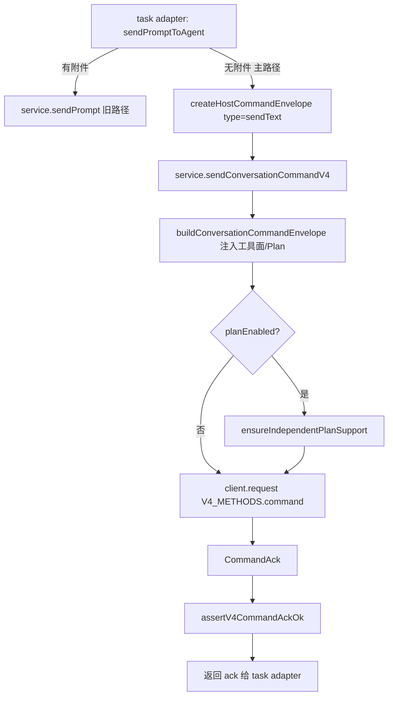

# 10 · 函数级源码解析：Host 侧 Service Adapter（命令下发收口）

> 上一篇：[09 · 函数级源码解析：Core AgentRuntime](./09-函数级源码解析-Core-AgentRuntime.md)
> 总目录：[README.md](./README.md)
> 下一篇：[11 · 函数级源码解析：Desktop Main + Host](./11-函数级源码解析-Desktop-Main-Host.md)

本篇聚焦 **Host（services 层）如何把一个"发送文本"意图收敛成一条 V4 命令，并下发给 Agent CLI**。它是 Layer 2/3 主链路在 services 进程里的收口点：

```
UI dispatchCommand (renderer)
  → ConversationTransport.sendCommand (renderer)
    → zcodeAgentService.sendConversationCommandV4  (host services)   ◀── 本篇入口
      → buildConversationCommandEnvelope            (host services)
      → client.request(V4_METHODS.command, ...)      (RPC → CLI)
    ← CommandAck
  → task adapter.sendPromptToAgent  (host services)  ◀── 上层调用方
```

涉及三个文件：

| 文件 | 角色 |
| --- | --- |
| `packages/services/src/zcode-agent/zcodeTaskServiceAdapter.ts` | Task facade → V4 命令的内部适配层（`sendPromptToAgent`） |
| `packages/services/src/zcode-agent/zcodeAgentService.ts` | Agent CLI 的 RPC facade（`sendConversationCommandV4` / `buildConversationCommandEnvelope`） |
| `packages/services/src/zcode-agent/zcodeV4HostCommand.ts` | host 侧命令信封构造 + ACK 收口共用件（`createHostCommandEnvelope` / `assertV4CommandAckOk`） |

---

## 10.1 总览：一条 sendText 在 services 层的转化



关键事实：

- **无附件主路径收敛到 `sendConversationCommandV4`**（见 `zcodeTaskServiceAdapter.ts` +436~+462）；带附件的旧路径仍走 legacy `service.sendPrompt`（见 +412~+435）。
- **幂等键对齐**：task adapter 把本轮 `traceId` 同时作为信封 `commandId`（见 +458 `commandId: params.traceId`），CLI 侧再以该 `commandId` 作为 `inputId` 起 turn，终端事件的 `inputId` 才能与 host command queue 的 `traceId` 对账。
- **`heldQueueDisposition: "keepQueueAndSend"`**（见 +451）：等价旧 `session/send` 的"立即发送、不动队列"语义，replayable 无人机交互路径沿用。

---

## 10.2 `sendPromptToAgent`（task adapter）

**符号定位**：`packages/services/src/zcode-agent/zcodeTaskServiceAdapter.ts`
`sendPromptToAgent` 函数定义于 **+375**；本篇分析 +375~+472 主发送段（try 块 +410~+463）。

**签名（简化）**：

```typescript
async function sendPromptToAgent(
  target: TaskTarget,
  params: {
    traceId: TraceId;
    queryId?: string;
    messageId?: string;
    content: string;
    attachments?: ZCodePromptAttachment[];
    toolDenylist?: string[];
    clientId?: string;
    clientMode?: ZCodeTaskClientMode;
    logReason?: string;
    modelSelection?: CommandPayloadMap["sendText"]["modelSelection"];
    modelExecution?: CommandPayloadMap["sendText"]["modelExecution"];
  } & ZCodeBackgroundTurnAttribution,
): Promise<void>
```

**参数 / 返回值**：

- `target`：`TaskTarget`，含 `taskId`（= V4 sessionId）、`workspacePath`、`workspaceIdentity?`、`remoteSessionId?`。
- `params.traceId`：单次输入的 `inputId`，也是后续对账的 `commandId`。
- 返回 `Promise<void>`；失败抛错由外层上报。

**关键内部逻辑（逐段）**：

1. **前置通知与投影清理**（见 +392~+399）：
   - `notifySyncerSession(target)`：通知同步器该 session 有活动。
   - `clearLiveToolProjection(target)` / `clearStreamingToolInputCache(target)`：新输入开始时清掉上一轮 live-only 子工具，避免 snapshot 把旧工具补到新回复尾部。
   - `activePromptInputIds.set(taskKey(target), params.traceId)`（+399）：记录"当前 session 正在跑的 inputId"，用于手机 owner command 的 stale 防护。

2. **日志**（见 +400~+409）：`logger.info(traceId, "ZCode task facade sendPrompt 开始", {...})`，携带 attachmentCount / queryId / textLength / workspaceKey。

3. **分支：有附件 vs 无附件**（见 +411~+463）：
   - 有附件（见 +412~+435）：保留 legacy `service.sendPrompt`（注释明确：v4 sendText 的 attachments 仍是 `attachmentRef` 引用模型，上传/寄存命令面尚未建模；过渡归宿 = v4 附件命令面）。
   - 无附件（见 +436~+462）：走 V4 主路径：
     ```typescript
     const ack = await options.zcodeAgentService.sendConversationCommandV4({
       workspacePath: target.workspacePath,
       workspaceIdentity: target.workspaceIdentity,
       ...(target.remoteSessionId ? { remoteSessionId: target.remoteSessionId } : {}),
       ...(params.clientMode ? { clientMode: params.clientMode } : {}),
       envelope: createHostCommandEnvelope({
         type: "sendText",
         payload: {
           text: params.content,
           heldQueueDisposition: "keepQueueAndSend",
           ...(params.modelSelection ? { modelSelection: params.modelSelection } : {}),
           ...(params.modelExecution ? { modelExecution: params.modelExecution } : {}),
           ...turnAttributionOf(params),
           ...(promptToolDenylist ? { toolDisallowlist: promptToolDenylist } : {}),
         },
         sessionId: target.taskId,
         commandId: params.traceId,   // ◀ 幂等键：inputId→commandId 对齐
         clientId: params.clientId,
       }),
     });
     assertV4CommandAckOk("sendText", ack, `session=${target.taskId}`);
     ```
   - `promptToolDenylist = resolvePromptToolDenylist(params)`（见 +411）：把 `params.toolDenylist` 解析成 V4 载荷的 `toolDisallowlist`。

4. **成功日志**（见 +464~+472）：`logger.info(traceId, "ZCode task facade sendPrompt ACK", {durationMs, taskId, workspaceKey})`。

5. **失败处理**（见 +473~+480+）：`activePromptInputIds.delete(taskKey(target))`（释放 inputId 占用），`logger.warn(...)`，错误向上抛。

**调用关系**：

- 调用方：`zcodeTaskServiceAdapter.ts` 内的 task service 实现（如 `dispatchOffPeakRun` 见 `host/index.ts` +645、`dispatchCronRun` 见 `host/index.ts` +932 均通过 `zcodeTaskService.sendPrompt` → 最终落到此 `sendPromptToAgent`）。
- 被调：`createHostCommandEnvelope`（本篇 10.4）、`sendConversationCommandV4`（10.3）、`assertV4CommandAckOk`（10.5）、`resolvePromptToolDenylist`、`turnAttributionOf`。

---

## 10.3 `sendConversationCommandV4`（Agent RPC facade）

**符号定位**：`packages/services/src/zcode-agent/zcodeAgentService.ts`
`sendConversationCommandV4` 方法定义于 **+5026**；本篇分析 +5026~+5091。

**签名**：

```typescript
async sendConversationCommandV4(params: ZCodeAgentConversationCommandParams): Promise<CommandAck>
```

其中 `ZCodeAgentConversationCommandParams` 含 `workspacePath`、`workspaceIdentity?`、`remoteSessionId?`、`clientMode?`、`envelope: CommandEnvelope`。

**关键内部逻辑（逐段）**：

1. **取客户端**（见 +5027）：`const client = await getClient(params)`——从 process manager 拿到（或懒拉起）Agent CLI 的 RPC 客户端。

2. **Plan 能力探测**（见 +5028~+5039）：
   ```typescript
   const planPayload = params.envelope.payload as { planEnabled?; config?; firstInput? };
   if (planPayload.planEnabled || planPayload.config?.planEnabled || planPayload.firstInput?.planEnabled) {
     await ensureIndependentPlanSupport(client);
   }
   ```
   独立 Plan 状态需 server 端支持；旧 host 会剥掉未知字段，故先 ensure。

3. **clientMode 真相**（见 +5042~+5045）：
   ```typescript
   const commandClientMode =
     readTrustedZCodeAgentV4Connection(params)?.clientMode ??
     params.clientMode ??
     "desktop-continuous";
   ```
   RPC facade 清掉调用方可伪造的顶层 `clientMode`，用 trusted carrier 注入 host 真值；host 内部 adapter 直调仍兼容显式 `clientMode`。

4. **createSession 预同步**（见 +5046~+5054）：`createSession` 时 `await ensureAccountProviderConfigSynced(...)`，等待 Account Config 就绪（Built-in / Personal 由 Worker 进程 Registry 自装配）。

5. **信封二次构造**（见 +5055）：`let envelope = await buildConversationCommandEnvelope(params)`（见 10.6）注入工具面 flag / Plan gate。

6. **TTFT 观测开关**（见 +5056~+5064）：
   ```typescript
   if (commandClientMode !== "desktop-continuous" || params.workspaceIdentity?.trim() || params.remoteSessionId) {
     const { ttft: _ttft, ...withoutTtft } = envelope;
     envelope = withoutTtft;   // 仅可信桌面本地 continuous 才开本地 TTFT 观测
   }
   ```

7. **浏览器环境上下文注入**（见 +5065~+5083）：若 `envelope.type === "sendText" && envelope.sessionId`，调用 `collectBrowserAmbientContext(...)`，把 `browserAmbientContext` 合并进 payload（仅当非空）。

8. **下发并回 ACK**（见 +5084~+5090）：
   ```typescript
   const ack: CommandAck = await client.request(V4_METHODS.command, envelope, commandAckSchema);
   return ack;
   ```
   注释强调：prompt command 在 `committed TurnStarted` 或 `committed WorkspaceHookReviewRequested` 任一 authority 到达后即返回；`duplicate` 只证明 commandId 曾处理过，不证明目标仍是当前 session 配置（旧 B 命令在用户切 C 后重放不能借 duplicate 改回 B）。

**调用关系**：

- 调用方：`sendPromptToAgent`（10.2）、renderer 侧 `agentConversationTransport.sendCommand`（见 doc 12）。
- 被调：`getClient`、`ensureIndependentPlanSupport`、`ensureAccountProviderConfigSynced`、`buildConversationCommandEnvelope`（10.6）、`collectBrowserAmbientContext`、`client.request(V4_METHODS.command, ...)`（RPC 层，见 doc 07 transport 桥）。

---

## 10.4 `createHostCommandEnvelope`（信封构造）

**符号定位**：`packages/services/src/zcode-agent/zcodeV4HostCommand.ts`
`createHostCommandEnvelope` 函数定义于 **+57**。

**签名**：

```typescript
export function createHostCommandEnvelope<T extends CommandType>(
  input: CreateHostCommandEnvelopeInput<T>,
): CommandEnvelope
```

`CreateHostCommandEnvelopeInput<T>`（见 +38~+54）字段：`type`、`payload`、`sessionId`（createSession 为 null）、`commandId?`、`clientId?`、`baseRevision?`、`baseLogEpoch?`。

**关键内部逻辑**：

1. **CAS 守卫**（见 +60~+62）：
   ```typescript
   if (COMMANDS_REQUIRING_BASE_REVISION.has(input.type) && input.baseRevision === undefined) {
     throw new Error(`command ${input.type} 是 CAS 命令，必须携带 baseRevision`);
   }
   ```
2. **行定位守卫**（见 +63~+65）：`ROW_TARGETING_COMMANDS` 缺 `baseLogEpoch` 直接抛。
3. **组装信封**（见 +66~+75）：
   ```typescript
   return {
     commandId: input.commandId ?? uuidv7(),
     clientId: input.clientId ?? hostV4ClientId,
     sessionId: input.sessionId,
     ...(input.baseRevision !== undefined ? { baseRevision: input.baseRevision } : {}),
     ...(input.baseLogEpoch ? { baseLogEpoch: input.baseLogEpoch } : {}),
     type: input.type,
     payload: input.payload,
     issuedAt: Date.now(),
   };
   ```

**host 稳定 clientId**：`hostV4ClientId = host-services-${uuidv7()}`（见 +36）——host 进程级稳定；pendingCommands 展示与幂等表以它区分提交端。host 重启 = 新提交端，但幂等表以 `commandId` 为键不受影响。

**与 renderer 工厂平行**：renderer 的 `createCommandEnvelope`（`packages/ui/src/v4/commandFactory.ts` +51）走浏览器 `localStorage` 持久化 clientId（刷新后不变）；host 因不能被 ui 反向依赖，单独实现一份（见文件头注释 +1~+5）。

---

## 10.5 `assertV4CommandAckOk`（ACK 收口）

**符号定位**：`packages/services/src/zcode-agent/zcodeV4HostCommand.ts` +102。

```typescript
export function assertV4CommandAckOk(
  commandType: CommandType,
  ack: CommandAck,
  contextMessage: string,
): CommandAck
```

**六态映射**（见 +107~+110、文件头注释 +96~+101）：

- `accepted` / `duplicate` / `noop` → 正常收口，返回 `ack`。
  - `duplicate`：同 commandId 重试回放，幂等成功；
  - `noop`：晚到应答/已收口，幂等成功（resolveInteraction 先到先得）。
- `rejected` / `stale` / `failed` → 抛 `ZCodeV4CommandRejectedError`，`code = "ZCODE_V4_COMMAND_REJECTED"`，`reasonCode` 原样携带给调用方（供结构化分流，不依赖错误文案）。

**调用点**：`sendPromptToAgent` 在 `sendConversationCommandV4` 返回后调用（见 +462 `assertV4CommandAckOk("sendText", ack, ...)`）。

---

## 10.6 `buildConversationCommandEnvelope`（信封能力注入）

**符号定位**：`packages/services/src/zcode-agent/zcodeAgentService.ts` +3270。

```typescript
async function buildConversationCommandEnvelope(
  params: ZCodeAgentConversationCommandParams,
): Promise<CommandEnvelope>
```

**逻辑分支**：

1. **createSession**（见 +3274~+3290）：若 `offPeakToolEnabled`（见 `isOffPeakToolSupported`）或 `dynamicWorkflowEnabled`（见 `resolveDynamicWorkflowGate`）为真，在 payload 注入 `offPeakToolEnabled` / `dynamicWorkflowEnabled`；否则原样返回（fail-closed）。工具面 flag 必须在信封处同源注入。
2. **非 sendText**（见 +3292）：原样返回。
3. **sendText + automationId**（见 +3298~+3308）：合并 `mergeAutomationMutationToolDenylist(payload.toolDisallowlist ?? [])`（只认本轮 payload，不把整个绑定会话永久视为 automation 上下文）。
4. **sendText + offPeakTaskId**（见 +3309~+3318）：合并 `mergeOffPeakMutationToolDenylist(...)`（只 deny OffPeakCreate，OffPeakList 只读保留）。
5. 其余 sendText 原样返回（见 +3319）。

**设计意图**：host facade 在信封层统一注入工具面/灰度 flag，避免调用方各自拼装导致漏传（旧 host 会剥未知字段，错发危险）。

---

## 10.7 数据流小结（一次 sendText 的字段行程）

```
task adapter.sendPromptToAgent
  params.content ──────────────► envelope.payload.text
  params.traceId ──────────────► envelope.commandId  (幂等键)
  target.taskId ───────────────► envelope.sessionId
  params.modelSelection ───────► envelope.payload.modelSelection
  params.toolDenylist ─────────► envelope.payload.toolDisallowlist (经 resolvePromptDenylist)
  turnAttributionOf(params) ───► envelope.payload.{automationId|offPeakTaskId|...}
        │
        ▼  sendConversationCommandV4
  buildConversationCommandEnvelope
        ├─ automationId? → 合并 automation 工具黑名单
        ├─ offPeakTaskId? → 合并 offPeak 工具黑名单
        └─ planEnabled? → 注入 planEnabled（已 ensure 能力）
  client.request(V4_METHODS.command, envelope) ──► Agent CLI (NDJSON v4/command)
        │
        ▼  CommandAck
  assertV4CommandAckOk("sendText", ack) ──► 六态收口
```

**诚实声明**：`getClient` 的懒拉起 / 连接建立 / RPC 序列化细节在 `zcodeAgentProcessManager` 与 doc 07 的 NDJSON transport 中，本篇不重复展开；`collectBrowserAmbientContext` 的具体收集字段当前源码未在本篇范围内逐行核对，需另读 `browserControlExecutor` 实现确认。

---

> 上一篇：[09 · 函数级源码解析：Core AgentRuntime](./09-函数级源码解析-Core-AgentRuntime.md)
> 总目录：[README.md](./README.md)
> 下一篇：[11 · 函数级源码解析：Desktop Main + Host](./11-函数级源码解析-Desktop-Main-Host.md)
