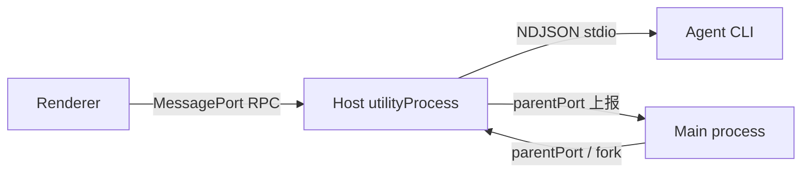

# 11 · 函数级源码解析：Desktop Main + Host（进程边界与启动编排）

> 上一篇：[10 · 函数级源码解析：Host ServiceAdapter](./10-函数级源码解析-Host-ServiceAdapter.md)
> 总目录：[README.md](./README.md)
> 下一篇：[12 · 函数级源码解析：UI SessionPane](./12-函数级源码解析-UI-SessionPane.md)

本篇覆盖 **桌面端的两道进程边界**：

1. **Main → Host**：`spawnHostProcess`（`packages/desktop/src/main/desktopHostProcess.ts`）用 Electron `utilityProcess.fork()` 拉起一个 Host 进程，每窗口一个。
2. **Host 自身初始化**：`packages/desktop/src/host/index.ts` 收到 `init-local` 消息后，装配 local services 并把 RPC service 暴露给 Renderer 的 MessagePort。

这是 Layer 1 进程模型（Main / Host / Agent CLI / Renderer）在桌面端的具体落地。

---

## 11.1 进程模型回顾（桌面端）



- **Main**：窗口管理、原生操作、`spawnHostProcess`、Host 退出预算管控。
- **Host**：每窗口一个 `utilityProcess.fork` 出来的 Node 进程；承载 local services + 远端连接 registry；通过 `parentPort` 与 Main 通信。
- **Agent CLI**：Host 内部的 `ZCodeAgentProcessManager` 以 `[app-server, --stdio]` 拉起（见 doc 13）。

---

## 11.2 `spawnHostProcess`（Main 侧 fork）

**符号定位**：`packages/desktop/src/main/desktopHostProcess.ts`
`spawnHostProcess` 函数定义于 **+151**，签名至 +229，fork 核心 +236~+258，消息处理 +284~+290+。

**签名（节选）**：

```typescript
export function spawnHostProcess(
  win: BrowserWindow,
  label: string,
  initMessage: HostInitMessage,
  dependencies: {
    hostProcessLocalEnv: Record<string, string>;
    desktopContextPromptEnabled?: () => boolean;
    logger: { info; warn };
    broadcastHub: BroadcastHub;
    taskRealtimeBus?: TaskRealtimeBus;
    windowHostProcessMap: Map<number, ElectronUtilityProcess>;
    hostRunningTaskCountMap: Map<ElectronUtilityProcess, number>;
    onWorkspaceRunningTaskCountChanged?; onAgentProcessExited?; onAgentProcessReady?;
    onCronRunResult?; onOffPeakRunResult?; handleBrowserExecuteRequest?;
    authorizeLocalMediaPreviewPath?;
    /* ... 大量回调，host → main 的事件桥 */
  },
  options?: SpawnHostProcessOptions,
): ElectronUtilityProcess
```

**关键内部逻辑**：

1. **hostId 与 binary 探测**（见 +230~+231）：`const hostId = randomUUID()`、`resolveBundledGlmBinaryPath()`（GLM 二进制路径，仅日志用）。
2. **execArgv**（见 +232~+235）：调试用 `--inspect-brk`（来自 `RUNTIME_ZCODE_DEBUG`）与 `--no-warnings`。
3. **fork 核心**（见 +236~+258）：
   ```typescript
   const child = electronUtilityProcess.fork(hostModulePath, [], {
     serviceName: formatZCodeHostProcessName(label),
     execArgv,
     env: {
       ...buildHostProcessEnv(dependencies.hostProcessLocalEnv),
       ...buildHostE2ECoverageEnv(),
       ZCODE_PROCESS_LABEL: label,
       // macOS-only：把 main（dev.zcode.app，已签名）的 pid 作为 CUA launcher-pid，
       // 让 Helper 的签名/peer 校验通过（Windows/Linux 不读该 env）。
       ...(process.platform === "darwin"
         ? { ZCODE_CUA_LAUNCHER_PID: String(process.pid) }
         : {}),
       ...(dependencies.desktopContextPromptEnabled
         ? { [ZCODE_DESKTOP_CONTEXT_PROMPT_ENABLED_ENV]:
             dependencies.desktopContextPromptEnabled() ? "1" : "0" }
         : {}),
     },
   });
   ```
   - `hostModulePath`：Host 入口模块（即 `packages/desktop/src/host/index.ts` 的打包产物）。
   - `ZCODE_PROCESS_LABEL`：窗口 label，Host 内部据它设 `process.title`（见 11.3）。
   - `ZCODE_DESKTOP_CONTEXT_PROMPT_ENABLED_ENV`：Main 已完成灰度裁决，Host 只消费快照、不自行分桶。
4. **日志中继**（见 +271~+281）：`createHostLogRelay` 把 Host 的 stdout/stderr 转回 Main logger；进程级 stdout 无请求身份，连接进度由 Host 侧 `RemoteWorkspaceConnectionLog` 按 requestId 上报（见 +269~+270 注释）。
5. **数据库启动中继**（见 +283）：`bindDatabaseStartupRelay(win, child, hostId)`。
6. **消息分发**（见 +284~+290+）：`child.on("message", ...)` 用 `hostResponseMessageSchema.safeParse(message)`，仅处理 schema 成功的 Host→Main 上报（AgentProcessSpawned / RunningTaskCountChanged / CronRunResult 等）；解析失败的帧被静默丢弃。

**注意**：本函数只负责"拉起 Host 并接管它的退出/日志/上报"，**不发送 `init-local`**——`init-local` 由 Main 在窗口就绪后通过 Host 的 MessagePort 单独发出（见 11.3 的 `parentPort.on("message")` 中 `InitLocal` 分支）。

---

## 11.3 Host 入口 `index.ts` 启动编排

**符号定位**：`packages/desktop/src/host/index.ts`
入口模块顶层执行 +183~+2000+；与 init 最相关的：

- `process.title` 设置（见 +187）：`formatZCodeHostProcessName(process.env["ZCODE_PROCESS_LABEL"])`，方便系统进程列表过滤。
- `const { parentPort } = process`（见 +183）：Host 与 Main 的唯一通道。
- 各类 reporter（见 +1034~+1104）：`runtimeProcessLifecycleReporter` / `runtimeTaskReporter` / `cuaOperationStateReporter`，满足 `createLocalServices` 的参数契约（`satisfies`），通过 `parentPort.postMessage` 上报 Agent 进程生命周期、运行 task 数、CUA 操作状态。

### 11.3.1 `parentPort.on("message")` 总入口

**符号定位**：`host/index.ts` +2273。
一个巨大的 `parentPort.on("message", async (e) => {...})` 分发器，按 `msg.type` 路由 Main→Host 消息（见 grep 结果：共 30+ 分支）。关键分支：

| msg.type | 行 | 作用 |
| --- | --- | --- |
| `DatabaseStartupControl` | +2282 | 数据库启动阶段控制 |
| `InitLocal` | +2748 | **窗口初始化唯一入口**（见 11.3.2） |
| `ConnectRemoteWorkspace` | +2537 | 远端 SSH/WSL/Docker 连接 |
| `AttachServicePort` | +2697 | Renderer/手机 attachment 到本 Host |
| `CronRun` | +2339 | 定时任务派发 → `dispatchCronRun` |
| `OffPeakRun` | +2375 | 闲时任务派发 → `dispatchOffPeakRun` |
| `Dispose` | +2419 | 退出收口（`runHostShutdownPhases`） |
| `Broadcast` | +2427 | 广播同步主题/语言等 |

### 11.3.2 `InitLocal` 分支（local services 装配）

**符号定位**：`host/index.ts` +2748~+2902。

**逻辑（逐段）**：

1. **port 校验**（见 +2749~+2752）：`init-local` 必须携带 `MessagePort`，否则 `logger.error` 返回。
2. **重复保护**（见 +2753~+2757）：若 `databaseStartup` 已存在（Host 已初始化），关闭该 port 并 `databaseStartup.coordinator.publish()`，直接返回——每窗口 Host 只应被 init 一次。
3. **databaseStartup 装配**（见 +2762~+2900）：`createHostDatabaseStartup({...})`，关键回调：
   - `cwd` / `workingDirectories`：来自 `msg.agentSpawnFallbackCwd` 与 `msg.agentWarmupTargets`（见 +2763~+2767）。
   - `publish(state)`（见 +2769~+2781）：数据库 `ready` 后遍历 `pendingStartupAttachments` 执行挂起的 attachment。
   - **`initializeServices` 异步工厂**（见 +2787~+2899）——真正的服务装配：
     a. `activeSessionRealtimePort = createTaskRealtimeBridgeForHostInit(msg, parentPort)`（见 +2789）。
     b. `createSettingServiceWithMigrations()`（见 +2792~+2793）：旧 Team 补组织与网络代理读取共用同一 Setting 实例。
     c. `createHostApiNetworkTransport(...)`（见 +2794~+2801）：注入 proxy / noProxy / caCertPath。
     d. `initializeHostApiNetworkTransportOwner({ transport, establishOwner })`（见 +2802~+2854）：`establishOwner` 内调 **`createLocalServices({...})`**（见 +2806~+2849）：
        - 传入 `parentPort`、`settingService`、`hostApiNetworkTransport`、`processLifecycleReporter`、`taskRuntimeReporter`、`browserControlExecutor: browserControlMainBridge`、`onAutomationManualRunRequested: dispatchManualAutomationRun` 等。
        - `serviceAuthorityMode: "desktop-local"`、`runtimeSurface: "desktop_local_host"`（见 +2817~+2815）。
        - 赋值 `activeServices = initializedServices`（见 +2850）、`activeHostApiNetworkTransport = hostApiNetworkTransport`（见 +2851）。
     e. **Reporting Task Service 包装**（见 +2855~+2864）：用 `createReportingRemoteZCodeTaskService(zcodeTaskService, { reportRunningPromptCount: false })` 重新注册 `IZCodeTaskService`，拦截 `sendPrompt` 做 workspace 运行计数 / 远端 stream 镜像（Proxy 见 doc 10 关联）。
     f. `wireLocalResourceTelemetry(services)`（见 +2865）。
     g. **Agent 预热**（见 +2868~+2887）：按 `msg.agentWarmupTargets`（Main 已限 3 个）逐个 `warmUpZCodeAgent(services, target, ...)`，不能隐式扩大名单。
     h. **暴露 base attachment**（见 +2889~+2896）：`windowHostAttachmentRegistry.attach({ scope: { kind: "local" }, clientMode: "desktop-continuous", port })`——把 Renderer 的 MessagePort 接进 RPC ChannelServer。
4. **启动数据库**（见 +2901）：`await databaseStartup.coordinator.start()`，触发 phase 推进，ready 后由 `publish` 回调完成 attachment。

### 11.3.3 `exposeServicesOnMessagePort`（RPC 暴露）

**符号定位**：`host/index.ts` +1964（被 init 与 `AttachServicePort` 调用，见 +2091）。

- 用 `wrapElectronPort(port)` + `MessagePortProtocol` 构造 `ChannelServer`（见 +1972~+1978），`deferInit` 控制是否立即发 `Initialize`（remote 模式延迟发，避免 "Unknown channel" 超时，见 +1974~+1975 注释）。
- `createZCodeAgentConnectionScope(agentService, { connectionId, clientMode })`（见 +1982~+1987）：为 Agent RPC 建立连接 scope（clientMode = desktop-continuous / web-remote-replayable）。
- `IWindowControllerService` 注册为 `windowHostControllerRuntime.createAttachmentService()`（见 +1988~+1992），并用 `overrides` 覆盖远端媒体预览服务等（见 +1994~+1999）。

---

## 11.4 远端连接（host 域）

- `windowRemoteConnectionRegistry`（见 +1738）：`connect: createWindowRemoteConnectionHandle`，管理同一 Host 内多个远端 SSH/WSL/Docker 连接。
- `createWindowRemoteConnectionHandle`（见 +1614~+1736）：`setupRemoteConnection(target, ...)`（见 +1630，内部动态 `import("@zcode/server/remote")` 避免 local 模式加载 ssh2 崩溃，见 +101~+103 注释），构造 `createRemoteWorkspaceServiceCollection(...)`（见 +1664）注入本地 services 作为 source。
- `createReportingRemoteZCodeTaskService`（见 +1141~+1468）：Proxy 包装远端 task service，`sendPrompt` 时 `acquireTaskRunLease` + `publishStreamOp`（user_message / stream_event）做手机端实时镜像（读路径收敛 legacy 源，见 +1287~+1294 注释）。

---

## 11.5 诚实声明（范围边界）

- `createLocalServices` 的内部装配（Provider Registry / Model Selection / Task / Session / Automation Repo 等各 service 工厂）不在本篇逐函数展开；其装配顺序与依赖见 doc 06（配置与数据流）与 doc 04（核心模块与类关系）。
- 30+ 个 `parentPort.on("message")` 分支（CronRun / OffPeakRun / ConnectRemoteWorkspace / Dispose 等）本篇仅列路由表，未逐函数展开；`dispatchCronRun` / `dispatchOffPeakRun` 的 `sendPrompt` 调用已在 doc 10 覆盖。
- `runHostShutdownPhases`（`hostShutdownPhases.ts`）的退出 budget / 进程树回收细节，需另读该模块确认。

---

> 上一篇：[10 · 函数级源码解析：Host ServiceAdapter](./10-函数级源码解析-Host-ServiceAdapter.md)
> 总目录：[README.md](./README.md)
> 下一篇：[12 · 函数级源码解析：UI SessionPane](./12-函数级源码解析-UI-SessionPane.md)
