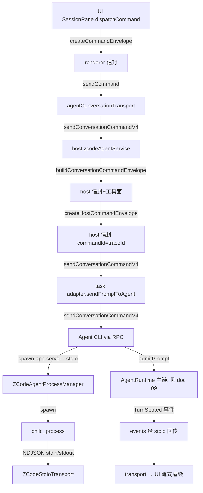

# 13 · 函数级源码解析：其他关键模块（进程管理 / Stdio 传输 / 命令收口件）

> 上一篇：[12 · 函数级源码解析：UI SessionPane](./12-函数级源码解析-UI-SessionPane.md)
> 总目录：[README.md](./README.md)
> （本篇为 Layer 4 最后一篇；后续见 README 完整性说明）

本篇补齐主链路三道关键"基础设施"边界，它们不在 Layer 2/3 的逐跳主链上，但任何一次 sendText 都依赖它们：

1. **Agent CLI 的拉起**：`ZCodeAgentProcessManager` 如何解析并执行 `[app-server, --stdio]`（host 进程内）。
2. **NDJSON stdio 帧边界**：`ZCodeStdioTransport` 如何切帧、转发、并在退出时整体回收进程树。
3. **host 侧命令收口件**：`zcodeV4HostCommand.ts` 的 `uuidv7` / `createHostCommandEnvelope` / `assertV4CommandAckOk` / `sendHostCasCommandV4`（CAS 重试）。

---

## 13.1 Agent CLI 命令解析与 spawn

**符号定位**：`packages/services/src/zcode-agent/zcodeAgentProcessManager.ts`

### 13.1.1 `resolveDefaultZCodeAgentCommand`（命令解析主入口）

**函数定义**：**+438**。返回 `ZCodeAgentCommand | null`。

**解析顺序**（见 +453~+463 注释与代码）：

```
env ZCODE_AGENT_SERVER_COMMAND 显式覆盖
  → resolveBundledWorkspaceZCodeAgentCommand  (monorepo dev 源码/dist)
  → resolveElectronRuntimeZCodeAgentCommand   (桌面打包态 Electron Node 跑 zcode.cjs)
  → resolveDeployedZCodeAgentBinaryCommand     (已部署 native binary，SSH/WSL 兜底)
```

各 resolver 产物（均含 `args: [... , "app-server", "--stdio"]`）：

| resolver | 行 | command | 关键 env |
| --- | --- | --- | --- |
| `resolveBundledWorkspaceZCodeAgentCommand` | +353 | `process.execPath` + `dist/zcode.cjs` / `zcode.bytecode.cjs` | `ELECTRON_RUN_AS_NODE: "1"`（+375） |
| `resolveElectronRuntimeZCodeAgentCommand` | +412 | `process.execPath` + `bundlePath` | `ELECTRON_RUN_AS_NODE: "1"`（+434），仅 `process.versions.electron` 存在时 |
| `resolveDeployedZCodeAgentBinaryCommand` | +391 | `findZCodeAgentRuntimeBinary()` | `ZCODE_AGENT_RUNTIME.spawnArgs`（+407） |

**关键事实**：

- `ELECTRON_RUN_AS_NODE: "1"`（见 +375 / +434）：Host 跑在 Electron utility process，子进程必须纯 Node 模式启动，否则被当成 Chromium 子进程卡在 GPU 初始化。
- env 显式覆盖优先（见 +441~+451）：`ZCODE_AGENT_SERVER_COMMAND` + `ZCODE_AGENT_SERVER_ARGS_JSON`（缺省 `["app-server","--stdio"]`），cwd 缺省回退 `context.workspacePath`。
- `applyPresentationSurfaceToCommand`（见 +458~+463）统一规范 presentation surface。

### 13.1.2 实际 spawn 站点

**符号定位**：`zcodeAgentProcessManager.ts` `getClient` 内部 **+1019**（spawn 调用），transport 装配 +1037。

```typescript
const child = spawn(effectiveCommand.command, spawnPreflight.args, {
  cwd: spawnPreflight.cwd,
  detached: shouldSpawnInDetachedProcessGroup(),   // POSIX 独立进程组，便于整树回收
  env: {
    ...sanitizeZCodeRuntimeEnv(process.env),
    [ZCODE_RUNTIME_ENV_KEY]: runtimeEnv,
    ...spawnEnv,
    ...effectiveCommand.env,
    ...buildAgentWorkspaceIdentityEnv(params.workspaceIdentity),  // 身份用 workspaceIdentity
    ...buildE2EAgentCoverageEnv(),
  },
  stdio: ["pipe", "pipe", "pipe"],
});
```

**前置屏障**（见 +1001~+1010）：admission 信号、disposed 检查、`restartGenerationByWorkspaceKey` 代际复查——避免恢复屏障期间重复拉起。

**transport 装配**（见 +1037~+1038）：
```typescript
const transport = new ZCodeStdioTransport(child, {
  onStderrLine: (line) => {
    const diagnostic = parseZCodeProcessDiagnostic(line);
    if (diagnostic && typeof child.pid === "number") {
      this.reportProcessLifecycle((reporter) => reporter.onException?.({
        pid: child.pid, provider: ZCODE_AGENT_PROVIDER,
        workspacePath: params.workspacePath, runtimeGeneration, runtimeInstanceId,
        diagnostic: { ...diagnostic, name: redact..., message: redact..., ... },
      }));
    }
  },
});
```

**调用关系**：

- 调用方：`ZCodeAgentProcessManager.getClient`（见 +832）被 `zcodeAgentService.getClient`（host，见 doc 10 §10.3）调用。
- 被调：`spawn`（node:child_process）、`resolveDefaultZCodeAgentCommand`、`ZCodeStdioTransport`（13.2）。

---

## 13.2 `ZCodeStdioTransport`（NDJSON stdio 帧边界）

**符号定位**：`packages/services/src/zcode-agent/zcodeStdioTransport.ts`
`ZCodeStdioTransport` 类定义于 **+35**，实现 `ZCodeProtocolTransport` 接口（`onMessage` / `onClose` / `send` / `dispose`）。

### 13.2.1 帧边界：只认 LF

**构造函数**（见 +55~+79）：

- `child.stdout.on("data", this.handleStdoutData)`（见 +63）：**不使用 Node `readline`**——`readline` 会把 U+2028/U+2029 当换行，模型文本含这类字符时会把合法 JSON 切成半帧（见 +61~+62 注释）。改用 `StringDecoder` 手动按 `\n` 切帧。
- `child.stdout.once("end"|"close", this.handleStdoutEnd)`（见 +64~+65）。
- `child.once("exit", ...)`（见 +68~+73）：子进程退出 → `fireClose` → `disposeReaders` → `waitForStderrDrain`。
- `child.once("error", ...)`（见 +74~+78）：spawn 失败 → `fireClose({ reason: error.message })`。

### 13.2.2 `send`（上行）

**方法定义**：**+81**，主体 +81~+95。

```typescript
async send(message: ZCodeProtocolMessage): Promise<void> {
  if (this.disposed || this.closed || this.child.killed || !this.child.stdin.writable) {
    throw new Error("ZCode agent stdio transport is closed");
  }
  const frame = `${JSON.stringify(message)}\n`;   // 帧以 LF 结尾
  await new Promise<void>((resolve, reject) => {
    this.child.stdin.write(frame, (error) => (error ? reject(error) : resolve()));
  });
}
```

### 13.2.3 下行切帧

- `handleStdoutData`（见 +209~+215）：`stdoutBuffer += decoder.write(chunk)` → `drainStdoutFrames()`。
- `drainStdoutFrames`（见 +231~+242）：`while ((newlineIndex = indexOf("\n")) >= 0)` 逐帧切片 → `handleStdoutFrame`。
- `handleStdoutFrame`（见 +244~+259）：去 `\r`（见 +245），空行跳过；`zcodeProtocolMessageSchema.parse(JSON.parse(line))`（见 +250），解析成功 `messageEmitter.fire(parsed)`（见 +254）；解析失败 `fireClose({ reason: "protocol_parse_error: ..." })`（见 +257）。
  - **数据面无进程表查询**（见 +251~+253 注释）：运行期只做解析+转发，完整进程树查询严格留在 dispose 边界，避免阻塞 Host event loop。
- `handleStreamError`（见 +261~+267）：stdin/stdout error → `fireClose`，阻止继续向失效 agent 写入（防 EPIPE 崩溃，见注释）。

### 13.2.4 退出与进程树整体回收（dispose）

**`dispose`**（见 +97~+110）：标记 `disposed`，`disposeLocalResources()`，`stderrCollector.waitForDrain(...)`；若 child 未退出且 Windows/POSIX 下 wrapper 可能拉起 runtime/MCP 后代，`terminateProcessTree(child, { ownedProcessGroupId })`（见 +108）。

**`disposeAndWait` / `disposeAndWaitOnce`**（见 +112~+207）：

- **保存快照时机**（见 +133~+150 注释）：stdin EOF 可能让 CLI 根进程先退出，detached MCP 仍运行；必须在发 EOF **前**保存树成员，否则根退出、后代被系统接管后无法按 PPID 找回。
- `captureCleanupSnapshot`（见 +336~+388）：活树用 `captureProcessTreeSnapshotAsync`；Windows CIM 查询失败回退 `identityVerification: "unavailable"` 快照（绝不向未验证复用 PID 发信号）。
- **EOF 优先**（见 +152~+168）：`requestStdioClose()`（发 stdin EOF，见 +294~+305）让 `app-server --stdio` 自然收尾；超时无响应再 `terminateProcessTreeAndWait`（见 +171）。
- **Windows deadline**（见 +141~+147 / +183~+186）：taskkill 上限 1s，使完整 cleanup 落在 Host service phase 3.5s 内。
- **残留即失败**（见 +200~+206）：`remainingPids.length > 0` 抛错（保留快照供 app quit 最终重试），不能静默当成功（否则 manager 立即释放 ownership 留下残留）。

### 13.2.5 调用关系

- 调用方：`getClient`（见 13.1.2）构造；`send` 被协议桥（doc 07 `ZCodeProtocolNdjsonConnection`）调用。
- 被调：`zcodeProtocolMessageSchema`（@zcode/shared）、`processTreeTerminator` 系列、`AgentStderrCollector`。

---

## 13.3 host 侧命令收口件 `zcodeV4HostCommand.ts`

**符号定位**：`packages/services/src/zcode-agent/zcodeV4HostCommand.ts`（全文件 159 行）。

### 13.3.1 `uuidv7`

**函数定义**：**+19**。RFC 9562 uuid v7：48-bit Unix ms 时间戳 + 74-bit 随机；与 renderer 工厂同构。供 `commandId` / `clientId` 生成（时间有序，重试不变）。

### 13.3.2 `createHostCommandEnvelope`

**函数定义**：**+57**。详见 doc 10 §10.4（host 稳定 `hostV4ClientId = host-services-${uuidv7()}`；CAS / 行定位守卫；组装 `commandId` / `clientId` / `sessionId` / `issuedAt`）。

### 13.3.3 `assertV4CommandAckOk`

**函数定义**：**+102**。详见 doc 10 §10.5（六态：`accepted`/`duplicate`/`noop` 收口；`rejected`/`stale`/`failed` 抛 `ZCodeV4CommandRejectedError`，`reasonCode` 原样携带）。

### 13.3.4 `sendHostCasCommandV4`（CAS 重试）

**函数定义**：**+122**，主体 +122~+158。

```typescript
export async function sendHostCasCommandV4<T extends CommandType>(input: {
  send: (envelope: CommandEnvelope) => Promise<CommandAck>;
  type: T;
  payload: CommandPayloadMap[T];
  sessionId: string;
  contextMessage: string;
  maxAttempts?: number;
}): Promise<CommandAck>
```

**逻辑**：

- `maxAttempts = input.maxAttempts ?? 4`（见 +130）。
- `let baseRevision = 0`（见 +131）：首发 baseRevision=0 作探测（host services 没有本地 v4 投影，拿不到当前 revision）。
- 循环（见 +133~+148）：`ack = await input.send(createHostCommandEnvelope({ type, payload, sessionId, baseRevision }))`；若 `ack.status === "stale"`，`baseRevision = ack.revisionAtDecision` 并 `continue`（用服务端回报的最新 revision 收敛重试，典型路径一次 stale 即命中）。
- 非 stale：`assertV4CommandAckOk(...)` 收口（见 +147）。
- 连续 stale 耗尽（见 +149~+157）：抛 `ZCodeV4CommandRejectedError`（病态并发下出现，按拒绝抛出）。

**与 renderer `dispatchConfigCas` 同构**（见 +113~+121 注释）：每次尝试新 `commandId`（stale 裁决不进幂等表）。

---

## 13.4 全链路收口：一次 sendText 的完整进程/模块行程



---

## 13.5 诚实声明（范围边界）

- `processTreeTerminator.ts`（`captureProcessTreeSnapshotAsync` / `terminateProcessTreeAndWait` / `terminateProcessTree`）的跨平台实现细节（POSIX killpg / Windows taskkill /T）未在本篇逐行展开，需另读该模块确认具体信号时序。
- `ZCodeAgentProcessManager.getClient` 的缓存/重连/代际（`restartGenerationByWorkspaceKey` / `runtimeInstanceId`）完整逻辑未全展开；本篇聚焦 spawn + transport 装配两处。
- `parseZCodeProcessDiagnostic` / `redactAgentDiagnostic` 的脱敏规则未展开。

---

> 上一篇：[12 · 函数级源码解析：UI SessionPane](./12-函数级源码解析-UI-SessionPane.md)
> 总目录：[README.md](./README.md)
