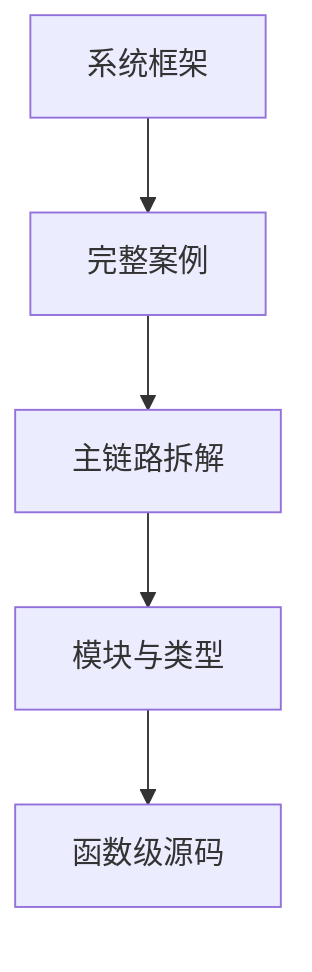

# ZCode 源码文档库

> **版本**：v1 (2026-09-23)
> **源码基准**：commit `872ad96`（v3.14.0, `feat: open source`, 2026-09-21）
> **定位**：新手可读、源码可定位、开发者可复现、能指导 Re-implement

## 阅读路径

推荐阅读顺序：**00 → 01 → 02 → 03 → 按兴趣选读 04~13**。

## 文档清单

### 规范层

| # | 文档 | 层级 | 说明 |
|---|------|------|------|
| 00 | [定位约定与源码引用格式](00-docs-style-guide.md) | 规范层 | 源码定位规则、图表惯例、术语 |

### 第一层：简单框架

| # | 文档 | 层级 | 说明 |
|---|------|------|------|
| 01 | [系统骨架](01-简单框架-系统骨架.md) | 第一层 | 进程模型、模块架构、依赖关系、数据流总览 |

### 第二层：简单例子

| # | 文档 | 层级 | 说明 |
|---|------|------|------|
| 02 | [真实案例全路径走读](02-简单例子-全路径走读.md) | 第二层 | 「用户发消息」从 UI 到结果的端到端场景 |

### 第三层：详细逐步说明

| # | 文档 | 层级 | 说明 |
|---|------|------|------|
| 03 | [主链路拆解](03-详细逐步说明-主链路拆解.md) | 第三层 | 逐跳拆解调用链，含函数名+偏移+数据流 |

### 第四层：源码补齐

| # | 文档 | 层级 | 说明 |
|---|------|------|------|
| 04 | [核心模块与类关系](04-核心模块与类关系.md) | 第四层 | 全部包的 Struct/Class/Trait/接口关系图 |
| 05 | [API与接口设计](05-API与接口设计.md) | 第四层 | V4 + 旧协议方法表 + 类型契约 |
| 06 | [配置与数据流](06-配置与数据流.md) | 第四层 | Provider Registry、Model Selection、Session DB |
| 07 | [CLI Bootstrap](07-函数级源码解析-CLI-Bootstrap.md) | 第四层 | runZCodeProtocolAgent + V4 Server + Transport |
| 08 | [V4 CommandExecutor](08-函数级源码解析-CLI-V4-CommandExecutor.md) | 第四层 | executor + handlers + prompt-turn + CommandInbox |
| 09 | [Core AgentRuntime](09-函数级源码解析-Core-AgentRuntime.md) | 第四层 | admitPrompt → turn loop → EventReducer |
| 10 | [Host ServiceAdapter](10-函数级源码解析-Host-ServiceAdapter.md) | 第四层 | zcodeTaskServiceAdapter + sendConversationCommandV4 |
| 11 | [Desktop Main+Host](11-函数级源码解析-Desktop-Main-Host.md) | 第四层 | spawnHostProcess + host/index.ts 初始编排 |
| 12 | [UI SessionPane](12-函数级源码解析-UI-SessionPane.md) | 第四层 | dispatchCommand + ConversationTransport.sendCommand |
| 13 | [其他关键模块](13-函数级源码解析-其他关键模块.md) | 第四层 | processManager/spawn、zcodeStdioTransport、命令收口件 |
